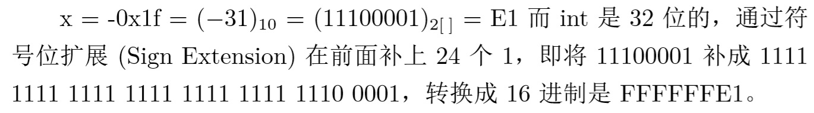

## 用二进制表示数值

| Problem | Solution | Overflow | Accuracy Error | 
|:-------------:|:------------------:|:------:|:------:|
| int8_t x = 67 | 01000011 | No | No |
| int8_t y = -7 | 11111001 | No | No |
| int8_t z = y - x | 10110110 | No | No |

| Problem | Solution | Overflow | Accuracy Error | 
|:-------------:|:------------------:|:------:|:------:|
| int8_t x = 0xd3 | 11010011 | Yes | No |
| uint8_t = 0xd3 | 11010011 | No | No|

| Problem | Solution | Overflow | Accuracy Error | 
|:-------------:|:------------------:|:------:|:------:|
| int8_t x = 127 | 01111111 | No | No |
| int8_t y = -7 | 11111001 | No | No |
| int8_t z = y - x | 01111010 | Yes | No |

| Problem | Solution | Overflow | Accuracy Error | 
|:-------------:|:------------------:|:------:|:------:|
| float x = 1.125 | 0 01111111 00100000000000000000000 | No | No | 
| float x = 23.0 | 0 10000011 01110000000000000000000 | No | No |
| float x = 0.45 | 0 01111101 11001100110011001100110 | No | Yes |

---

## 名词解释

### Method Of Complements

In mathematics and computing, the method of complements is a technique used to subtract one number from another using only addition of positive numbers. This method was commonly used in mechanical calculators and is still used in modern computers.
 **The nines' complement**  of a number is formed **by replacing each digit with nine minus that digit**. To subtract a decimal number y (the subtrahend) from another number x (the minuend) two methods may be used:
In the first method **the nines' complement of x is added to y**. Then the nines' complement of the result obtained is formed to produce the desired result.
In the second method **the nines' complement of y is added to x and one is added to the sum**. The leading digit '1' of the result is then discarded. Discarding the initial '1' is especially convenient on calculators or computers that use a fixed number of digits: there is nowhere for it to go so it is simply lost during the calculation. The nines' complement plus one is known as the tens' complement.
The method of complements can be extended to other number bases (radices); in particular, **it is used on most digital computers to perform subtraction, represent negative numbers in base 2 or binary arithmetic and test underflow and overflow in calculation.**

### Byte
The byte is a unit of digital information that most commonly **consists of eight bits**. Historically, the byte (symbol B) was the number of bits used to encode a single character of text in a computer and for this reason it is the smallest addressable unit of memory in many computer architectures. 

### Integer
In computer science, an integer is a datum of integral data type, a data type that represents some finite subset of the mathematical integers. Integral data types may be of different sizes and may or may not be allowed to contain negative values. Integers are commonly represented in a computer as a group of binary digits (bits). The size of the grouping varies so the set of integer sizes available varies between different types of computers. Computer hardware, including virtual machines, nearly always provide a way to represent a processor register or memory address as an integer.

### Floating Point
In computing, floating point is the formulaic representation that approximates a real number so as to support a trade-off between range and precision. A number is, in general, represented approximately to a fixed number of significant digits (the significand) and scaled using an exponent in some fixed base; the base for the scaling is normally two, ten, or sixteen. A number that can be represented exactly is of the following form:

$$
significand \times base ^{exponment}
$$

where significand is an integer (i.e., in Z), base is an integer greater than or equal to two, and exponent is also an integer. 

---

## 证明 
###### 对使用Latex编译出的进行了截图

#### 1）证明二进制负数的补码等于对应正数的反码加一

#### 2）Int8_t x = -017，用8进制描述变量X

#### 3）Int8_t x = -0x1f; int y = x; 用16进制表示x和y,并说明计算过程

#### 4）证明第三问问什么可以这样算，（符号位扩展的正确性）

.jpg)

.jpg)

#### 5）NaN的含义
NaN ("Not a Number") An IEEE floating point representation for the result of a numerical operation which cannot return a valid number value. A NaN can result from multiplying an infinity by a zero, or from subtracting one infinity from another NaN is encoded as a special bit pattern which would otherwise represent a floating-point number.
