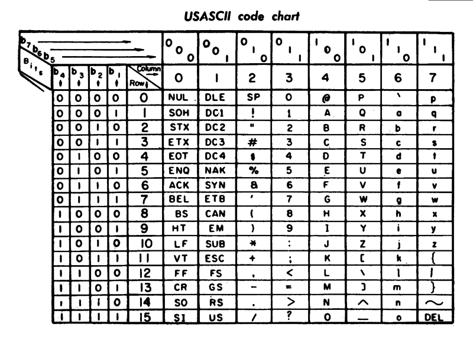

## 名词解释

### ASCII
ASCII abbreviated from American Standard Code for Information Interchange, is a character encoding standard.
ASCII codes represent text in computers, telecommunications equipment, and other devices. Most modern character-encoding schemes are based on ASCII, although they support many additional characters.

### Color

Color is the characteristic of human visual perception described through color categories. This perception of color derives from the stimulation of cone cells in the human eye by electromagnetic radiation in the spectrum of light. Color categories and physical specifications of color are associated with objects through the wavelength of the light that is reflected from them.
By defining a color space, colors can be identified numerically by coordinates. The RGB color space for instance is a color space corresponding to human trichromacy and to the three cone cell types that respond to three bands of light: long wavelengths, peaking near 564–580 nm (red); medium-wavelength, peaking near 534–545 nm (green); and short-wavelength light, near 420–440 nm (blue).

---

## 问题简答

#### 1) 写出字符“A”,“中”的 ASCII 码、Unicode 码、UTF-8 编码
| Character | ASCII | Unicode | UTF-8 |
| :-------: | :---: | :-----: | :---: |
|     A     |  0x41  | 0x0041  |  0x41 |
##### 0x表示十六进制

#### 2) Yellow的RGB编码
Yellow的RGB编码是 (R:255, G:255, B:0) 

#### 3) 从网上下载一个 BMP 格式图像,用图片编辑工具另存在 jpg、 png、tiff 格式。问三种格式中,哪种格式显示质量好?相对于BMP 格式,压缩率各是多少?
|  FORMAT   | NAME                                  | CHARACTERISTICS                                              |
| :-------: | :------------------------------------ | :----------------------------------------------------------- |
|    BMP    | Windows bitmap                        | Uncompressed format                                          |
|   TIFF    | Tagged Image File Format              | Lossless: Document scanning and imaging format.  |
|    PNG    | Portable Network Graphics             | Lossless: improve and replace GIF. Based on the DEFLATE algorithm. |
|   JPEG    | Joint Photographic Experts Group      | Lossy: big compression ratio, good for photographic images   |

> Patel Ranna Jayantibhai，Dr. Bhadresh Pravinbhai Patel An Analytical Study on Comparison of Different Image Compression Formats 2015

实验图片:

| 文件格式 | 大小 | 显示质量 | 压缩率 |
| :---: | :---: | :---: | :---: |
| BMP | 696KB | 差 | 1:1 | 
| PNG | 391KB | 别 | 1.78:1 |
| TIFF | 467KB | 不 | 1.49:1 | 
| JPG | 77.4KB | 大 | 8.99:1 |

The ratio of compression for TIFF is around 1.49:1, for PNG is around 1.78:1 and for JPEG we obtained a compression ratio of 8.99:1.

#### 4) Q:Winrar压缩文件是lossless还是lossy方法？
Winrar压缩文件是无损压缩(lossless)

---