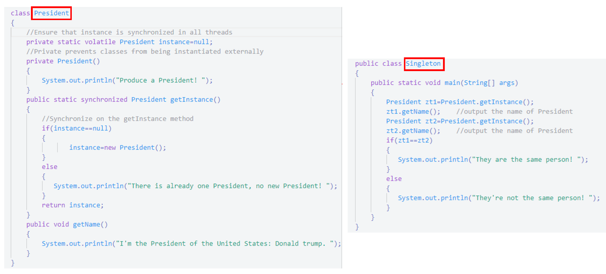
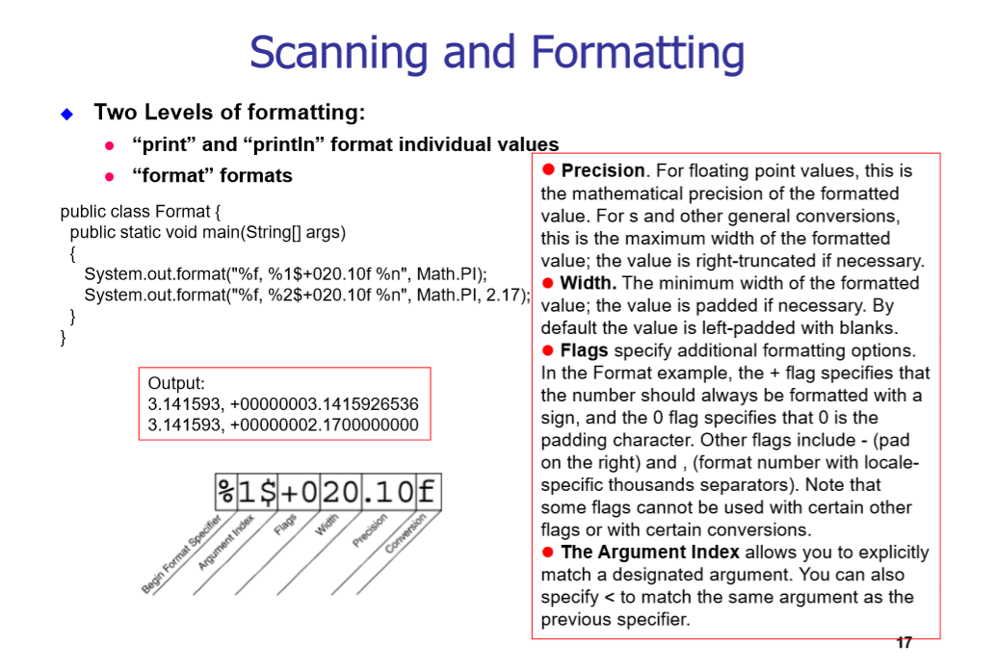
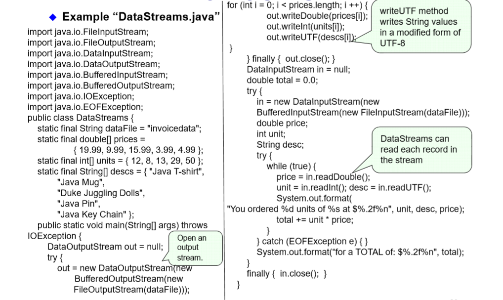

# Interfaces 接口

In its most common form, an interface is **a group of related methods with empty bodies**. A bicycle's behavior, if specified as an interface, might appear as follows：

    interface BicycleInterface { 
        // constant declarations, if any

        // method signatures 
        void changeCadence(int newValue); 
        void changeGear(int newValue); 
        void speedUp(int increment); 
        void applyBrakes(int decrement); 
    }

Interfaces form a contract between the class and the outside world, and this contract is enforced at build time by the compiler.
（不同牌子的汽车，有相同的操作，但这些不同场子的车不一定有同一个父类）

术语：**类去实现一个接口**，保留字**implements**

Interfaces cannot be instantiated——they can only be implemented by classes or **extended by other interfaces**.

Java does not permit multiple inheritance but interfaces provide an alternative. In Java, a class can inherit from only one class but it can implement more than one interface. 

An interface name can be used anywhere a type can be used.

#### 多接口的继承实例：//注意语法
An interface declaration consists of modifiers, the keyword interface, the interface name, a comma-separated list of parent interfaces (if any), and the interface body.

    public interface GroupedInterface extends Interface1, Interface2, Interface3 {
        // constant declarations 
        double E = 2.718282; 
        // base of natural logarithms
        // method signatures 
        void doSomething (int i, double x); 
        int doSomethingElse(String s);
}

#### Using an Interface as a Type

    InterfaceAinterfaceName = new ClassB(); 

#### Rewriting Interfaces

    public interface DoIt { 
        void doSomething(int i, double x); 
        int doSomethingElse(String s); 
    }
    //you want to add a third method to DoIt

    //问题操作
    public interface DoIt { 
        void doSomething(int i, double x); 
        int doSomethingElse(String s); 
        boolean didItWork(int i, double x, String s);
    }// If you make this change, all classes that implement the old DoIt interface will break because they don't implement the interface anymore. 

    //Now users of your code can choose to continue to use the old interface or to upgrade to the new interface
    public interface DoItPlus extends DoIt {
        boolean didItWork(int i, double x, String s);
    }

### 对比抽象类和接口

1. abstract classes can contain fields that are not static and final, and they can contain implemented methods. 

2.  It is possible to define a class that does not implement all of the interface methods, provided that the class is declared to be abstract. 

---

# Design Pattern 设计模式

### GoF Pattern

##### Creational Pattern: 

Factory Method, Abstract Factory, **Singleton**, Builder, Prototype

##### Structural Pattern:

Adapter, Bridge, Composite, **Decorator**, Facade, Flyweight, Proxy

##### Behavioral Pattern:

Command, Interpreter, Iterator, Mediator, **Observer**, State, Strategy, Chain of Responsibility, Visitor, Template Method

### Pattern: Singleton

定义：A pattern in which a class has only one instance and the class can create that instance itself

特点：

1. 在类里定义了一个该类的静态实例
2. 构造函数为privated
3. 成员函数getInstance()返回类的那个静态实例（如果instance == null，则new.

例子：

### Observer pattern

定义：In Observer pattern, the class can inform other objects which subscribe to a change of its state. Any object which is interested in this change, can subscribe to the target object, and receive this information while it occurs. 

类的设计：The Pattern contains two roles: **Subject**: a class that can inform others while its state has change. **Observer**: a class that interested in the change of the subject.

*Subject* : an abstract class, which has **add** method, **remove** method, a **List, whose element type is Observer** a abstract method named **notifyObserver**. 
*ConcreteSubject*: a class inherite from the Subject class, and implement the abstract method notifyObserver.

*Observer* : an *interface or abstract class*, which has a **notify** method. 
*ConcreteObserver* : a class inherite from the Subject class, and implement the abstract method notify.

例子：

    import java.util.*;
    public class RMBrateTest {
        public static void main(String[] args) {
            Rate rate = new RMBrate();
            Company watcher1 = new ImportCompany();
            Company watcher2 = new ExportCompany();
            rate.add(watcher1);
            rate.add(watcher2);
            rate.change(10);
            rate.change(-9);
        }
    }

    // abstract: Rate
    abstract class Rate {
        protected List<Company> companys = new ArrayList<Company>();

        // add
        public void add(Company company) {
            companys.add(company);
        }

        // remove
        public void remove(Company company) {
            companys.remove(company);
        }

        public abstract void change(int number);
    }

    class RMBrate extends Rate {
        public void change(int number) {
            for (Company obs : companys) {
                ((Company) obs).response(number);
            }
        }

    }

    // abstrct observer: Company
    interface Company {
        void response(int number);
    }

    class ImportCompany implements Company {
        public void response(int number) {
            if (number > 0) {
                System.out.println("RMBrate increase" + number + ", improved the profit margin of import companies");
            } 
            else if (number < 0) {
                System.out.println("RMBrate decrease" + (-number) + ", reduced the profit margin of import companies");
            } } }

### Decorator Pattern

定义： the Decorator Pattern is a design pattern that allows behavior to be added to an individual object, without affecting the behavior of other objects from the same class. 

we just need to implement the interface of the extended (decorated) object (Component) transparently by forwarding all requests to it. 

每个装饰者类继承装饰者类，且都有一个被装饰者的对象作为数据成员，并且重写装饰者类的成员函数（如果需要的话）

例子：

    public class StarBuzzCoffeeDemo {

        public static void main(String arg[]) {

            Coffee coffer = new SimpleCoffee();
            coffer = new WithMilk(coffer);
            System.out.println(coffer.getCost() + "$  " + coffer.getIngredients());
            coffer = new WithSprinkles(coffer);
            System.out.println(coffer.getCost() + "$  " + coffer.getIngredients());
        }
    }

    interface Coffee {
        public double getCost();

        public String getIngredients();
    }

    class SimpleCoffee implements Coffee {
        @Override
        public double getCost() {
            return 1;
        }

        @Override
        public String getIngredients() {
            return "Coffee";
        }
    }

    class BlackCoffee implements Coffee {
        @Override
        public double getCost() {
            return 2;
        }

        @Override
        public String getIngredients() {
            return "BlackCoffee";
        }
    }

    abstract class CoffeeDecorator  implements Coffee {
        private final Coffee decoratedCoffee;

        public CoffeeDecorator (Coffee c) {
            this.decoratedCoffee = c;
        }

        @Override
        public double getCost() {
            return decoratedCoffee.getCost();
        }

        @Override
        public String getIngredients() {
            return decoratedCoffee.getIngredients();
        }
    }

    class WithMilk extends CoffeeDecorator  {
        public WithMilk(Coffee c) {
            super(c);
        }

        @Override
        public String getIngredients() {
            return super.getIngredients() + ", Milk";
        }
    }

    class WithSprinkles extends CoffeeDecorator  {
        public WithSprinkles(Coffee c) {
            super(c);
        }

        @Override
        public double getCost() {
            return super.getCost() + 0.2;
        }

        @Override
        public String getIngredients() {
            return super.getIngredients() + ", Sprinkles";
        }
    }

### Proxy Pattern 代理模式

定义：In Proxy Pattern, the class can provide a sub-interface to another class, which provide other object with a proxy to control access to that object. 

---

# Basic I/O

流支持不同类型的数据：包括简单的字节，内置数据类型，对象

Java.io package 里有两部分：字符流(16-bit UTF-16 character stream)和字节流(8 bits byte streams),I/O既可以是基于文本(data-based)的，也可以是基于二进制数据(binary data-based)的:

输入输出流(Inout streams or output streams)是字节流(byte stream)，而Readers or writers 是字符流(character stream)的

### Byte Streams 读取写入文件实例：

    import java.io.FileInputStream;
    import java.io.FileOutputStream;
    import java.io.IOException;
    public class CopyBytes{
        public static void main(String[] args) throws IOException{
            FileInputStream in = null;
            FileOutoutStream out = null;
            try{
                in = new FileInputStream("test_in.txt");
                out = new FileOutputStream("test_out.txt");
                int c;
                while((c = in.read()) != 1)//read()从in中读取一个字节 a byte of data
                {
                    out.write(c);
                }
            } finally{
                if(in != null){
                    in.close();
                }
                if(out != null){
                    out.close();
                }
            }
        }
    }

    //finally作为异常处理的一部分，它只能用在try/catch语句中，并且附带一个语句块
    //finally表示这段语句最终一定会被执行（不管有没有抛出异常），经常被用在需要释放资源的情况下。

### Character Streams 读取写入文件实例：

    import java.io.FileReader;
    import java.io.FileWriter;
    import java.io.IOException;
    public class CopyCharacter{
        public static void main(String[] args) throws IOException{
            FileReader in = null;
            FileWriter out = null;
            try{
                in = new FileReader("test_in.txt");
                out = new FileWriter("test_out.txt");
                int c;
                while((c = in.read()) != 1)//read()从in中读取一个字符 a single character
                {
                    out.write(c);
                }
            } finally{
                if(in != null){
                    in.close();
                }
                if(out != null){
                    out.close();
                }
            }
        }
    }

### Character Streams (Buffuered)读取写入文件实例：

    import java.io.FileReader;
    import java.io.FileWriter;
    import java.io.BufferedReader;
    import java.io.PrintWriter;
    import java.io.IOException;
    public class CopyLines{
        public static void main(String[] args) throws IOException{
            BufferedReader in = null;
            PrintWriter out = null;
            try{
                in = new BufferedReader("test_in.txt");
                out = new PrintWriter("test_out.txt");
                String i;
                while((i = in.readLine()) != 1)//readLline()从in中读取一行字符串
                {
                    out.write(c);
                }
            } finally{
                if(in != null){
                    in.close();
                }
                if(out != null){
                    out.close();
                }
            }
        }
    }

### Filter Streams 

它是一个抽象类 我们要去继承它，然后定义成员函数 public int read()

### Scanner and Formatting

    import java.io.*;
    import java.util.Scanner;
    public class ScanXan{
        public static void main(String[] args)throws IOException{
            double sum = 0.0;
            Scanner s = null;
            try{
                s = new Scanner(new BufferedReader(new FileReader("text_in.txt")));
                while(s.hasNext())
                {
                    System.out.println(s.next());
                }
                while(s.hasNext())
                {
                    if(s.hasNextDouble) //Formatting 
                    {
                        sum += s.nextDouble();
                    }
                    else
                    {
                        s.next();
                    }
                }
            } finally{
                if(s != null){
                    s.close();
                }
            }
            System.out.println(sum);
        }
    }

#### System.out.format();

### Data Streams

支持内置数据类型和String，有专门的Read/Write methods  比如Char有readChar()和writeChar() 
案例：

### Object Streams 对象流 （Object Serialization 对象序列化） 
### File I/O

---

