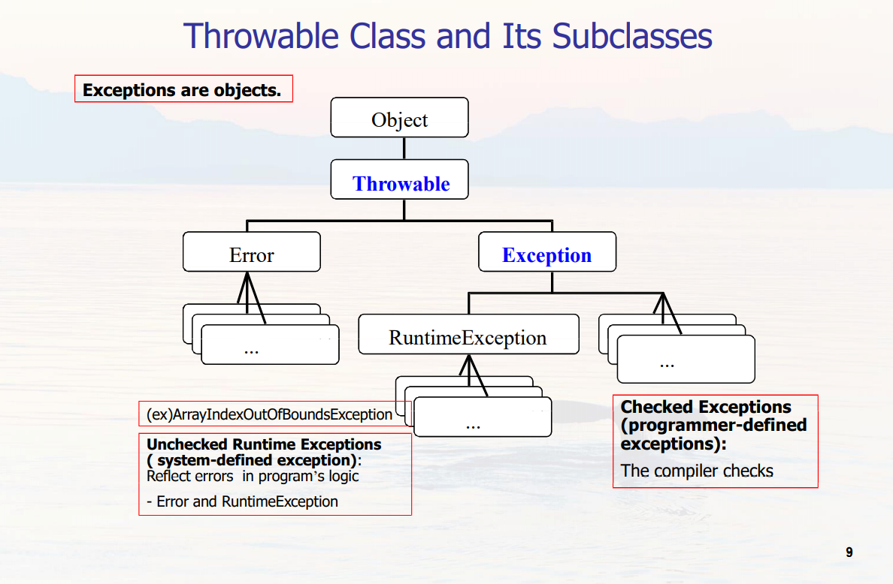
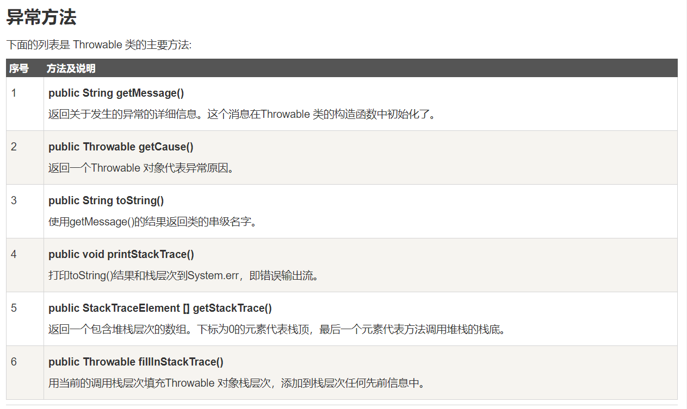
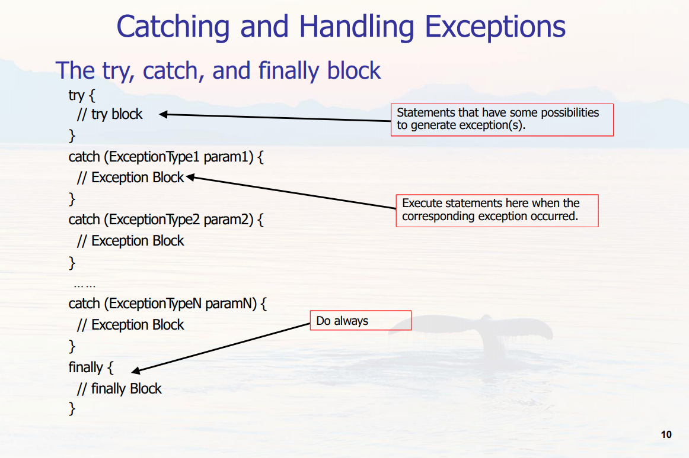
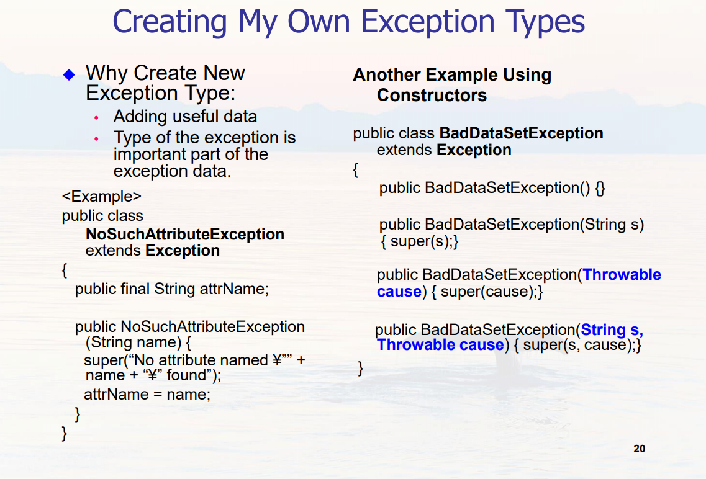
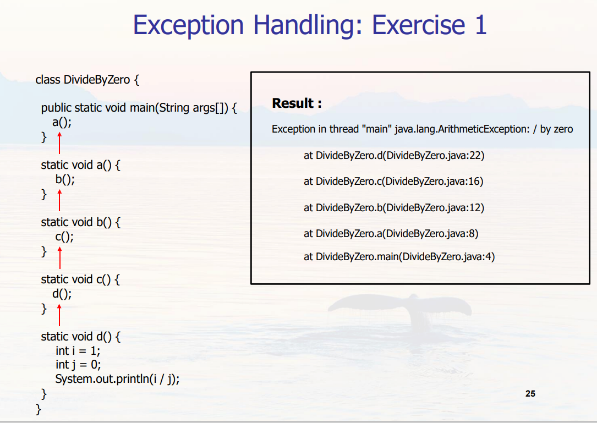
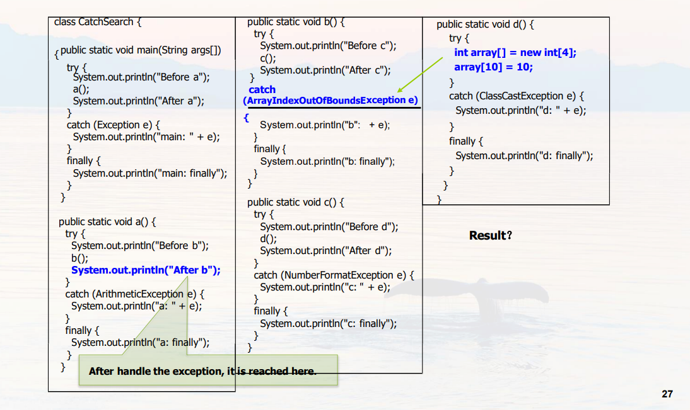
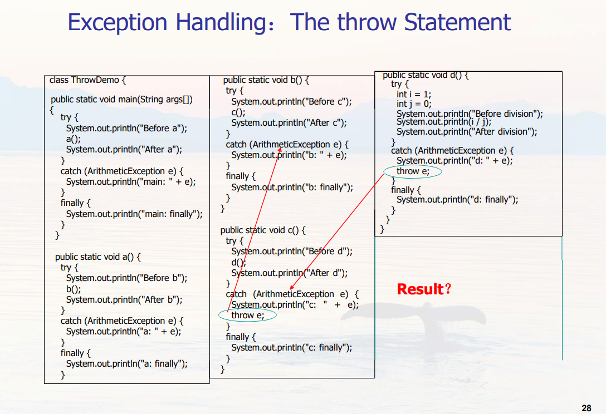

# Exceptions 异常处理

---

### 三种类型的异常：

**检查性异常**：最具代表的检查性异常是用户错误或问题引起的异常，这是程序员无法预见的。例如要打开一个不存在文件时，一个异常就发生了，这些异常在编译时不能被简单地忽略。例如：SQLException, IOException, FileNotFoundException

**运行时异常**： 运行时异常是可能被程序员避免的异常。与检查性异常相反，运行时异常可以在编译时被忽略。例如：ArithmeticException, ClassCastException, ArrayIndexOutOfBoundsException, NullPointerException

**错误**： 错误不是异常，而是脱离程序员控制的问题。错误在代码中通常被忽略。例如，当栈溢出时，一个错误就发生了，它们在编译也检查不到的。例如：System malfunction, OutOfMemoryException, StackOverflowError

理解：
    1、检查性异常: 不处理编译不能通过
    2、非检查性异常:不处理编译可以通过，如果有抛出直接抛到控制台
    3、运行时异常: 就是非检查性异常
    4、非运行时异常: 就是检查性异常

---

### Exception 类的层次

所有的异常类是从 java.lang.Exception 类继承的子类。 Exception 类是 Throwable 类的子类。除了Exception类外，Throwable还有一个子类Error。 Java 程序通常不捕获错误。错误一般发生在严重故障时，它们在Java程序处理的范畴之外。 Error 用来指示运行时环境发生的错误。

---

### Java 内置异常类和方法

链接：https://www.runoob.com/java/java-exceptions.html

---

### 关键字 try catch throw finally

#### throws / throw

如果一个方法没有捕获到一个检查性异常，那么该方法必须使用 throws 关键字来声明。throws 关键字放在方法签名的尾部。

也可以使用 throw 关键字抛出一个异常，无论它是新实例化的还是刚捕获到的,多个异常之间用逗号隔开。
下面方法的声明抛出一个 RemoteException 异常：

    import java.io.*;
    public class className
    {
    public void deposit(double amount) throws RemoteException
    {
        // Method implementation
        throw new RemoteException();
    }
    //Remainder of class definition
    }

#### finally 
关键字用来创建在 try 代码块后面执行的代码块。
无论是否发生异常，finally 代码块中的代码总会被执行。
在 finally 代码块中，可以运行清理类型等收尾善后性质的语句。
finally 代码块出现在 catch 代码块最后。

---

### 自定义异常类

所有异常都必须是 Throwable 的子类。
如果希望写一个检查性异常类，则需要继承 Exception 类。

下图是几种声明类型：

---

### 几则练习

#### Exercise 1

#### Exercise 2
    class Divide {
        public static void main(String args[]) {
            try {
            System.out.println("Before Division");
            int i = Integer.parseInt(args[0]);
            int j = Integer.parseInt(args[1]);
            System.out.println(i / j);
            System.out.println("After Division");
            }
            catch (ArithmeticException e) {
            System.out.println("ArithmeticException");
            }
            catch (ArrayIndexOutOfBoundsException e) {
            System.out.println("ArrayIndex" +
            "OutOfBoundsException");
            }
            catch (NumberFormatException e) {
            System.out.println("NumberFormatException");}
            finally {
                System.out.println("Finally block");
            }
        }
    }

String args[]为空的输出：

    Before Division
    ArrayIndexOutOfBoundsException
    Finally block

#### Exercise 3

输出：//自己写的 有可能有问题子

    Before a 
    Before b 
    Before c 
    Before d 
    d: finally 
    c: finally 
    b: e(ArrayIndexOutOfBoundsException) 
    b: finally 
    After b 
    a: finally 
    After a 
    main: finally

#### Exercise 4

输出：//自己写的 有可能有问题子

    Before a
    Before b
    Before c
    Before d
    d: e
    d: finally
    c: e
    c: finally
    b: e
    b: finally
    After b
    a: finally
    After a
    main: finally

---

资料来源，参考：

**陈老师的Java课网站：http://inpluslab.com:8000/java2020/**

**菜鸟教程：https://www.runoob.com/java/java-exceptions.html**