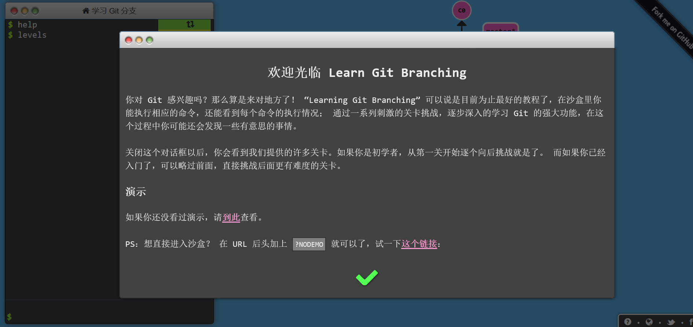

# GitNote主要篇

#### 本学习经验来源 Learn Git Branching 
##### https://learngitbranching.js.org/?locale=zh_CN

<blockquote>
  
<strong>
Git 是一个开源的分布式版本控制系统，用于敏捷高效地处理任何或小或大的项目。</strong>

</blockquote>

---
## 基础篇

### git commit
修改了代码库并保存成一个新的提交记录（这个提交记录的内容可以是你对本地项目的改动），把它看作一个节点，它的父亲节点是上一个提交记录
可以加入commit，如 git commit -m "A Little Try"

### git branch 分支名
创建一个新的分支 我想基于这个提交记录以及他的所有父提交进行新的工作
操作方法 git branch 分支名
例如 git branch newImage 创造了一个叫做newImage的新分支
创建之后 输入 git commit 只有master分支前进了，而newImage保持不动，因为此时星号*标注在master上，星号表示当前所在的分支

### git checkout 分支名
表示将星号移动到我们要求的分支上

### git merge 分支名
表示把我们提到的分支名合并到当前带星号的分支上
注意这个merge会形成一个新的提交，然后当前星号指示的分支指向这个新的提交

### git rebase 分支名
我们在我们提到的分支名下建立了新的提交，此时星号指示的分支指向这个新的提交，我们得到一个线性的提交序列，星号分支原来指向的提交没有消失。

---
## 提高篇—在提交树上移动

### HEAD
指向你正在其基础上进行工作的提交记录，总是指向当前分支的最近一次提交记录
分离的HEAD就是让其指向某个具体的提交记录而不是分支名
比如只有master分支时，HEAD指向master，master指向提交记录C1（C1是哈希值）可以使用git log来查看提交记录的哈希值
使用 git checkout C1 后，变成了 HEAD 指向C1

### 相对引用
使用 ^ 向上移动一个提交记录 使用例子 git checkout master^
使用 ~< num > 向上移动多个提交记录，如 ~3 例子 git checkout~4

### 强制修改分支位置
移动分支，可以直接使用 -f 选项让分支指向另一个提交
如 git branch -f master HEAD~3 会将master分支强制指向 HEAD的第三级父提交

### 撤销变更 git reset 和 git revert

git reset 把分支记录会退几个提交记录来撤销改动 git reset 向上移动分支，例如 git reset HEAD~1 而在reset后，之前的变更（在移动HEAD之前HEAD的指向内容还在，只是处于未加入暂存区状态 （这种改写方式对远程分支是无效的)
git revert 可以用于远程分支，撤销更改并分享给别人 使用git revert HEAD后，在我们要撤销的记录后面多了一个新提交，这个新提交记录引入了更改—这些更改用来撤销原提交

### 整理提交记录 git cherry-pick
如果你想将一些提交复制到当前位置（HEAD）下面的话
git cherry-pick 记录名（哈希值）（多个 依次），git就回吧这多个记录一一复制到当前分支下。

### 交互式的rebase
它会打开一个UI界面 你可以通过鼠标拖放来调整提交记录的顺序；或删除你不想要的提交（通过切换pick的状态来完成；或合并提交，允许你把多个记录合并成一个
例子有一条从C0到C5的提交记录，master指向C5
git rebase -i HEAD~4
git会严格按照你在对话框中指定的方式进行复制

---
## 杂项

### 提交的技巧
用git rebase -i来重新提交排序，把想修改的移到前面
再用git commit —amend 来进行小修改
再用git rebase -i 来讲它们调回原来的顺序
再把master移到最前面

因为cherry-pick可以将提交树上的任何地方的提交记录取过来追加到HEAD上（只要不是HEAD上游就行）

### git tag
永远指向某个分支的标识，可以像分支一样对其进行引用了
git tag v1 c1 
c1为提交记录（哈希值），给他标记v1
如果不指定提交记录，默认会用HEAD所指向的位置
但不能直接在标签下做commit

### git describe
用来描述离你最近的标签
git describe < ref >
< ref >指任何能被git识别成提交记录的引用（可以是分支名，提交哈希值，标签），如果没有指定，会默认HEAD
他的输出结果： < tag >_< numCommits >_g< hash >
tag是离你最近的标签 numCommit指ref与tag相差多少个提交记录，hash表示你所给定的ref所表示的提交记录哈希值的前几位，而如果当ref提交记录上有某个标签时，则只输出标签名称

### 选择父提交记录
如果有两个父提交，git checkout master^ 表示返回第一个 git checkout master^2 表示返回第二个父提交上
还支持链式操作 git checkout HEAD~ ^2~2 *(在 ~ 与 ^ 之间没有空格)*

---
*本文是我学习Learngitbranching的一些学记笔记，Learngitbranching中还有**远程篇**，（包括我们很多常用的操作）该兴趣的读者也可以进入 Learngitbranching https://learngitbranching.js.org/?locale=zh_CN 学习。*
*由于小作者学习精力有限，不少步骤没有进行实际操作，如有错误望举出[跪]。*
### Git学习的推荐阅读：

[1] 菜鸟教程git教程 https://www.runoob.com/git/git-tutorial.html

[2] Git完整指令手册 https://git-scm.com/docs

---