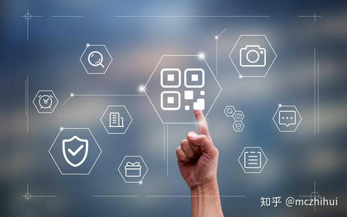
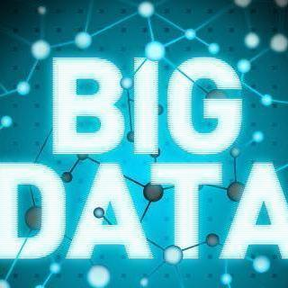
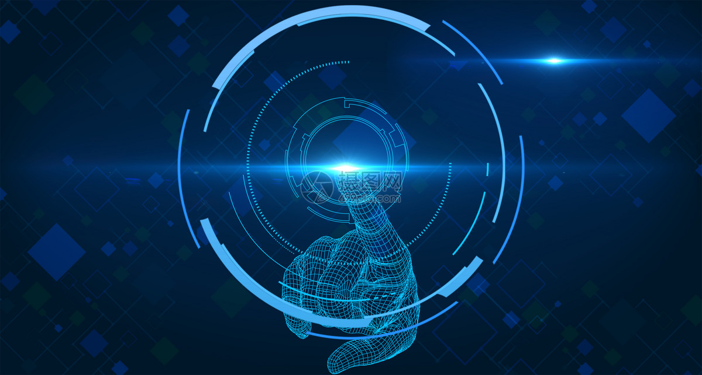
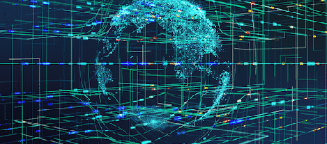
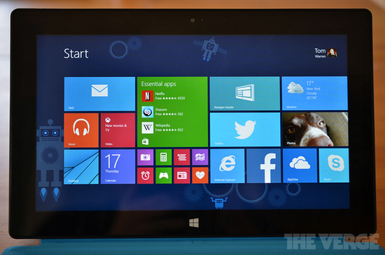

# 互联网时代的热点领域选择、营销方法

在互联网时代的浪潮下，万物皆可互联网+，区块链，人工智能，大数据成为互联网时代的热点领域，与此同时，在互联网时代的背景下，新的营销方法如雨后春笋般被提出，应用，造就新的品牌，本篇博客着眼几个互联网时代的热点领域和营销方法，作简要的介绍。

## 热点领域

### 区块链技术

所谓区块链技术，简称BT(Blockchain technology)，也被称之为分布式账本技术，是一种互联网数据库技术，其特点是去中心化、公开透明，让每个人均可参与数据库记录。最早是比特币的基础技术，目前世界各地均在研究，可广泛应用于金融等各领域。

区块链技术就像互联网一样，它具有内置的稳健性。通过存储在其网络中相同的信息块，区块链不能: 1、受任何单一实体控制。2、没有单点故障。

区块链技术具有的不可篡改、可以追溯等特点，可以和物联网技术具有的连接随手可及、计算无处不在等特点结合起来，借助物联网，在某一产品单元生产完成后，可以生成该产品的关键信息，比如生产设备加工该产品时采用的工艺数据，测试设备对该产品进行质检后得到的量测数据，这些数据打包成消息（比如JSON格式）。

引用自知乎 https://zhuanlan.zhihu.com/p/338784867

### 大数据

大数据（big data），指无法在一定时间范围内用常规软件工具进行捕捉、管理和处理的数据集合，是需要新处理模式才能具有更强的决策力、洞察发现力和流程优化能力的海量、高增长率和多样化的信息资产。 在维克托·迈尔-舍恩伯格及肯尼斯·库克耶编写的《大数据时代》中大数据指不用随机分析法（抽样调查）这样捷径，而采用所有数据进行分析处理。大数据的5V特点（IBM提出）：Volume（大量）、Velocity（高速）、Variety（多样）、Value（低价值密度）、Veracity（真实性）。

转载自知乎 https://www.zhihu.com/topic/19740929/intro

### 人工智能

人工智能（Artificial Intelligence），英文缩写为AI。它是研究、开发用于模拟、延伸和扩展人的智能的理论、方法、技术及应用系统的一门新的技术科学。
人工智能是计算机科学的一个分支，它企图了解智能的实质，并生产出一种新的能以人类智能相似的方式做出反应的智能机器，该领域的研究包括机器人、语言识别、图像识别、自然语言处理和专家系统等。人工智能从诞生以来，理论和技术日益成熟，应用领域也不断扩大，可以设想，未来人工智能带来的科技产品，将会是人类智慧的“容器”。人工智能可以对人的意识、思维的信息过程的模拟。人工智能不是人的智能，但能像人那样思考、也可能超过人的智能。
人工智能是一门极富挑战性的科学，从事这项工作的人必须懂得计算机知识，心理学和哲学。人工智能是包括十分广泛的科学，它由不同的领域组成，如机器学习，计算机视觉等等，总的说来，人工智能研究的一个主要目标是使机器能够胜任一些通常需要人类智能才能完成的复杂工作。

源自百度百科 https://baike.baidu.com/item/%E4%BA%BA%E5%B7%A5%E6%99%BA%E8%83%BD/9180

### 工作流技术

工作流就是“业务过程的部分或整体在计算机应用环境下的自动化”，它主要解决的是“使在多个参与者之间按照某种预定义的规则传递文档、信息或任务的过程自动进行，从而实现某个预期的业务目标，或者促使此目标的实现”。

工作流系统，实现了工作流程的自动化，提高了企业运营效率，改善企业资源利用，提高企业运作的灵活性和适应性，提高量化考核业务处理的效率，减少浪费。
在java领域中，JBPM和Actvity是两个主流的工作流系统，而Flowable的出现无疑将会取代两个主流的工作流系统。

摘自博客 https://blog.csdn.net/weixin_42809672/article/details/82503011

### 云计算

云计算（cloud computing）是分布式计算的一种，指的是通过网络“云”将巨大的数据计算处理程序分解成无数个小程序，然后，通过多部服务器组成的系统进行处理和分析这些小程序得到结果并返回给用户。云计算早期，简单地说，就是简单的分布式计算，解决任务分发，并进行计算结果的合并。因而，云计算又称为网格计算。通过这项技术，可以在很短的时间内（几秒钟）完成对数以万计的数据的处理，从而达到强大的网络服务。
现阶段所说的云服务已经不单单是一种分布式计算，而是分布式计算、效用计算、负载均衡、并行计算、网络存储、热备份冗杂和虚拟化等计算机技术混合演进并跃升的结果。

摘自百度百科 https://baike.baidu.com/item/%E4%BA%91%E8%AE%A1%E7%AE%97/9969353

### 量子计算

量子计算是一种遵循量子力学规律调控量子信息单元进行计算的新型计算模式。对照于传统的通用计算机，其理论模型是通用图灵机；通用的量子计算机，其理论模型是用量子力学规律重新诠释的通用图灵机。从可计算的问题来看，量子计算机只能解决传统计算机所能解决的问题，但是从计算的效率上，由于量子力学叠加性的存在，某些已知的量子算法在处理问题时速度要快于传统的通用计算机。

摘自百度百科 https://baike.baidu.com/item/%E9%87%8F%E5%AD%90%E8%AE%A1%E7%AE%97/11035661?fr=aladdin

## 营销方法

### O2O经济

O2O，是Online To Offline的缩写即在线离线/线上到线下，是指将线下的商务机会与互联网结合，让互联网成为线下交易的平台，这个概念最早来源于美国。O2O的概念非常广泛，既可涉及到线上，又可涉及到线下,可以通称为O2O。主流商业管理课程均对O2O这种新型的商业模式有所介绍及关注。

O2O营销模式又称离线商务模式，是指线上营销线上购买带动线下经营和线下消费。O2O通过打折、提供信息、服务预订等方式，把线下商店的消息推送给互联网用户，从而将他们转换为自己的线下客户，这就特别适合必须到店消费的商品和服务，比如餐饮、健身、看电影和演出、美容美发、摄影等。
实现O2O营销模式的核心是在线支付。

和O2O类似的还有B2B（也有写成 BTB，是Business-to-Business的缩写）是指企业与企业之间通过专用网络或Internet，进行数据信息的交换、传递，开展交易活动的商业模式。它将企业内部网和企业的产品及服务，通过 B2B 网站或移动客户端与客户紧密结合起来，通过网络的快速反应，为客户提供更好的服务，从而促进企业的业务发展。

·参考百度百科 O2O O2O营销模式 B2B

### 小米的饥饿营销

“饥饿营销”，运用于商品或服务的商业推广，是指商品提供者有意调低产量，以期达到调控供求关系、制造供不应求“假象”、以维护产品形象并维持商品较高售价和利润率的营销策略。

·参考 https://new.qq.com/omn/20200510/20200510A0IMJQ00.html

·参考知乎 https://zhuanlan.zhihu.com/p/31692491

### 微软的软件捆绑

案例： 微软向企业发布365软件包：捆绑销售Windows和Office

·参考网页 http://tech.sina.com.cn/roll/2017-07-11/doc-ifyhvyie0996429.shtml

·参考简书 https://www.jianshu.com/p/0af0740c96b2
