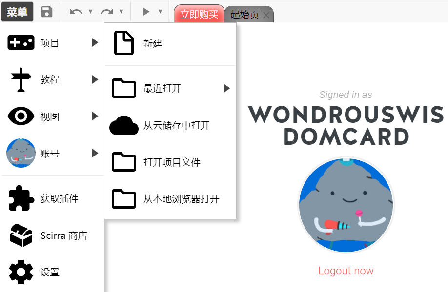
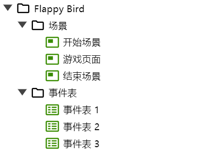
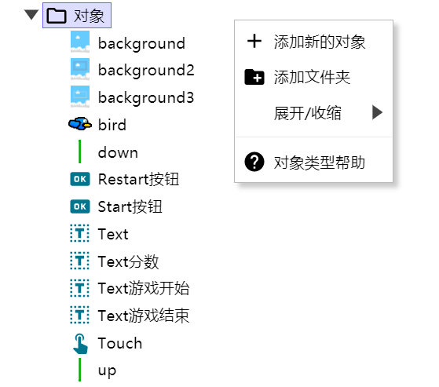
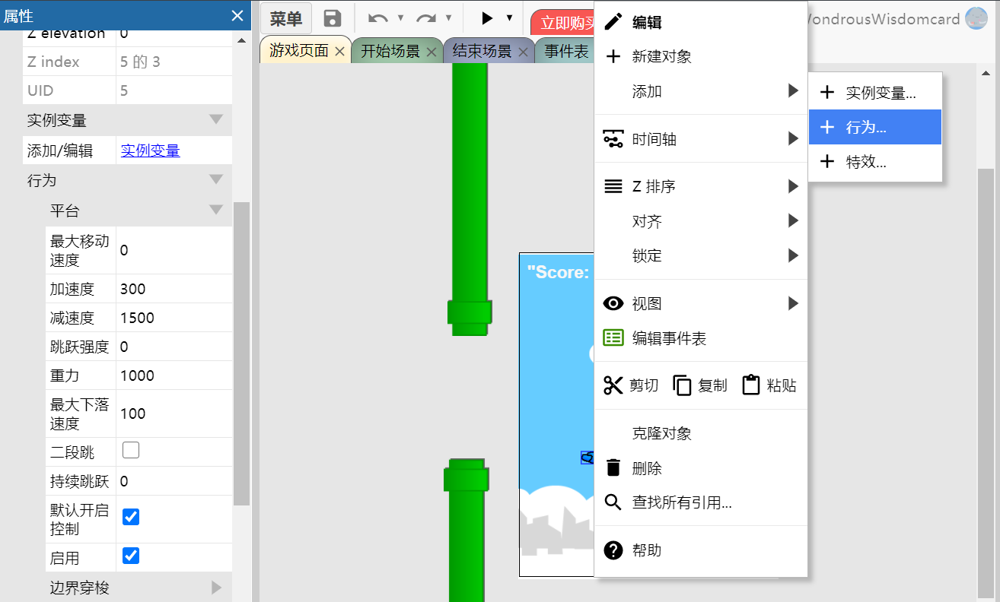
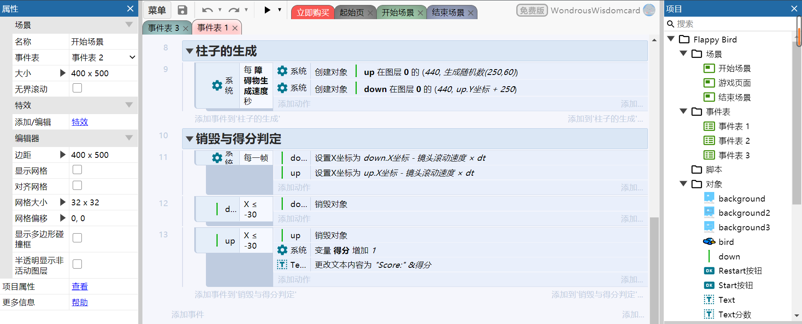
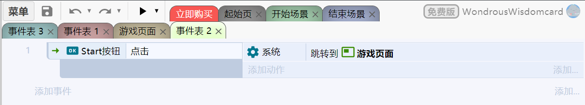
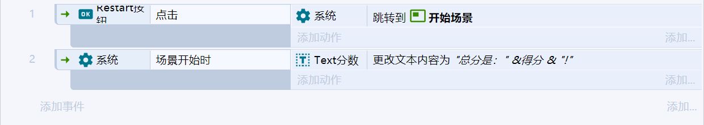
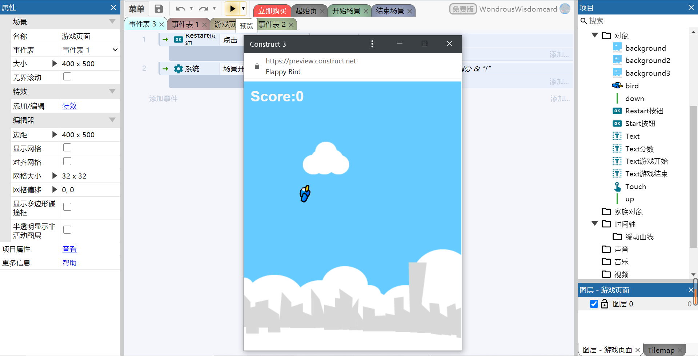

# 笨比飞扬鸟

### 笨比飞扬鸟简单地模仿了经典游戏**Flappy Bird**

**游戏链接:** https://www.construct.net/en/free-online-games/free-game-17945/play (手机端和PC端都可以玩)

**视频链接:** https://www.bilibili.com/video/BV1S54y1y7P7/ 

---

## 设计思路

1. **游戏规则**
   
   玩家需要通过点击鼠标/屏幕来使小鸟跳起来来避免迎面而来的绿柱子，在玩家不进行操作的情况下，笨比小蓝鸟会因为重力而往下掉。当小鸟撞上绿柱子时，游戏结束。

2. **界面的设定**

    我们需要三个界面：游戏启动界面，游戏界面和游戏结束界面。通过游戏启动界面的**start**按钮，玩家可以进入游戏界面进行游戏，当小鸟撞上绿柱子时界面转入游戏结束界面，游戏结束界面显示玩家本轮游戏的分数，并且玩家可以通过**restart**按钮重新进入游戏启动界面。

3. **对象和对象行为**

    小鸟(**bird**)可以进行跳跃，否则坠落，具有平台(Platform)属性,需要考虑小鸟的下落速度(和加速度)，还有小鸟跳跃一次的高度。

    柱子(上柱子**up**和下柱子**down**)需要系统以一定的速率生成，并且能够向左移动，并在出界后自动销毁。其中上下柱子需要同时生成，并具有一样的速率，之间留出的间隔需要合理（保证小鸟能过去）,还需要用到随机生成器来是系统每次生成的柱子高度不同。

    计分器(全局变量**count**)需要在小鸟通过一对柱子后计分，并显示在游戏页面左上方。

    其余对象还包括文本显示对象(**text**)和输入对象(**touch**),按钮(**button**)和背景(**background**),他们都是游戏不可缺的元素。

4. **事件表**
   
    *将事件表的事件进行分组有利于我们更清晰地安排事件。*

    分组包括“界面的跳转”，“小鸟的碰撞”，“障碍物的生成和销毁”，“得分的判定”。(在**制作过程**中有体现)
---

## 制作过程

1. 收集素材
   
    
    **素材来自张羿九学长！**

2. 基本过程
   
   1. 先创建一个新的项目
    

   2. 创建了三个背景板和对应的事件表，分别处理不同界面的事件：(下图出现在construct3界面的右侧)
    

   3. 单击右键**创建对象**，也可以直接将图片拖入场景版中直接创建对象
    
   4. **给对象赋予行为**(右键单击对象-添加-行为)，以小鸟为例，需要给他赋予**平台**，并在左栏中给小鸟的速度等赋值，可参考图片：
    
   5. **构建事件表**，可参考下面几张图(有一点乱)：
   
        游戏界面的事件表:
        
        
        开始界面的事件表:
        
        结束界面的事件表:
        
   6. 最后可以耍小聪明美化一下开始结束界面，点击顶部菜单旁边的三角形预览游戏试玩（记得保存项目）。 
        
   7. **小经验**
   
        可以先看construct3里的游戏实例(https://editor.construct.net/ 里的**demo**)，体验一下，刚开始不用担心看不明白或者看不全游戏的对象，事件表等是如何安排的，先有个大致印象。到自己实现小游戏时，对一个功能或逻辑不清楚的时候想想之前看的游戏案例有没有实现，再去翻看找到答案！

---

## 问题思考

### “0基础”用户为什么能较好编程制作游戏？例如，使用 Events sheet 和 Script 选择的区别
1. 相对于编程，图形化的游戏设计程序显然能降低设计游戏的门槛，使用construct3或迷你世界设计游戏，设计者无需掌握脚本语言的，底层的技术被封装好，设计者能专注于处理游戏的安排的设计，减少了设计者的工作量。给予我个人的体验，使用construct3做游戏的全过程包括学习案例，参考案例，设计游戏；若使用脚本语言则需要先学习并熟悉脚本语言，才能设计并编写游戏，耗时长成本高。
2. 相比于脚本语言，显然显示成表的事件表具有更高的可读性，设计者无需掌握脚本语言的。

### 这些平台如何表达游戏世界的事物和行为？

 如同C++的类，可以通过类的数据成员和成员函数来模拟现实世界的事物和这些事物的行为，而这些平台则是通过对象和对象的动作来模拟游戏世界，同时这些平台提供的对象更针对于游戏的设计，比如精灵和子弹等概念。

---