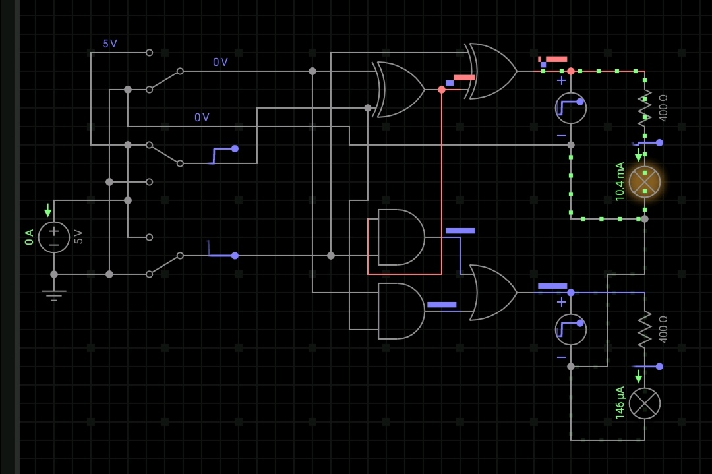
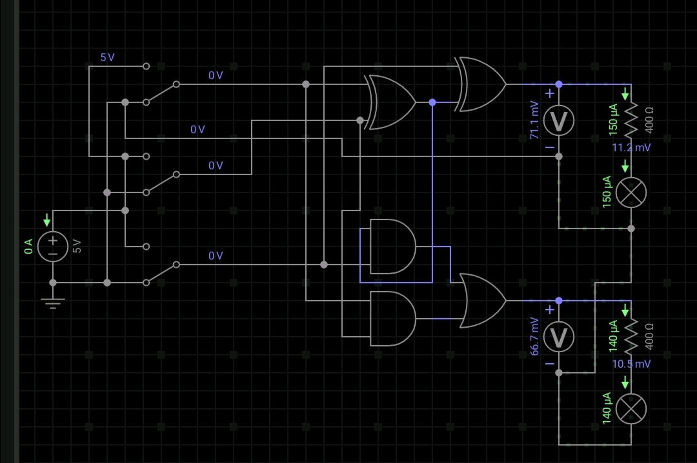

# 硬件编程-电路与二进制运算

---

### 任务一：门电路的设计与功能验证

| In A | In B | Out |
|:-:|:-:|:-:|
|0|0|0|
|0|1|0|
|1|0|0|
|1|1|1|

电路图如下：其中电压设置为5伏，电阻为400欧，两个开关分别代表In A和In B

验证如下：

#### 用XOR门作非门

电路如下，异或门一个输入接高电平：

实验验证：

---

### 任务二：验证电路 A(B+C) 和 AB+AC 等价

电路搭建及验证：三个开关从上到下依次代表A，B，C

真值表：O1代表A(B+C),02代表AB+AC
| A | B | C | O1 | O2 |
|:-:|:-:|:-:|:-:|:-:|
|0|0|0|0|0|
|0|0|1|0|0|
|0|1|0|0|0|
|0|1|1|0|0|
|1|0|0|0|0|
|1|0|1|1|1|
|1|1|0|1|1|
|1|1|1|1|1|

可以看到O1,O2等价。

---

### 任务三：理解SR储存电路

电路搭建：

表格填写：

| ~Set | ~Reset | Q(x) | ~Q(x) |
|:-:|:-:|:-:|:-:|
|1|1|0|1|
|0|1|1|0|
|1|1|1|0| 
|1|0|0|1|
|1|1|0|1|

---

### 任务四：设计全加电路

---

#### (1)一位全加器：有S = (A 异或 B) 异或 C，Carry = (A 异或 B) C + AB

如图：三个开关从上到下依次代表A，B，C

A + B + C = 0 + 0 + 1 = 1,S = 1,Carry = 0

A + B + C = 0 + 1 + 0 = 1,S = 1,Carry = 0

A + B + C = 0 + 1 + 1 = 10,S = 0,Carry = 1

A + B + C = 1 + 0 + 0 = 1,S = 1,Carry = 0

A + B + C = 1 + 0 + 1 = 10,S = 0,Carry = 1

A + B + C = 1 + 1 + 0 = 10,S = 0,Carry = 1

A + B + C = 1 + 1 + 1 = 11,S = 1,Carry = 1

A + B + C = 0 + 0 + 0 = 0,S = 0,Carry = 0

---

#### (2)两位的全加器

部分电路搭建与检验如下：
其中三面三个开关表示A0 B0 C0,下面两个开关表示A1 B1,
右边最上面的灯时S0,中间的灯表示Carry0,下面左边的灯表示S1，右边的灯表示Carry1.

表示 A = 00 B = 00 C = 0 S = 00 Carry1 = 0

表示 A = 01 B = 11 C = 0 S = 00 Carry1 = 1

表示 A = 11 B = 11 C = 1 S = 11 Carry1 = 1

---