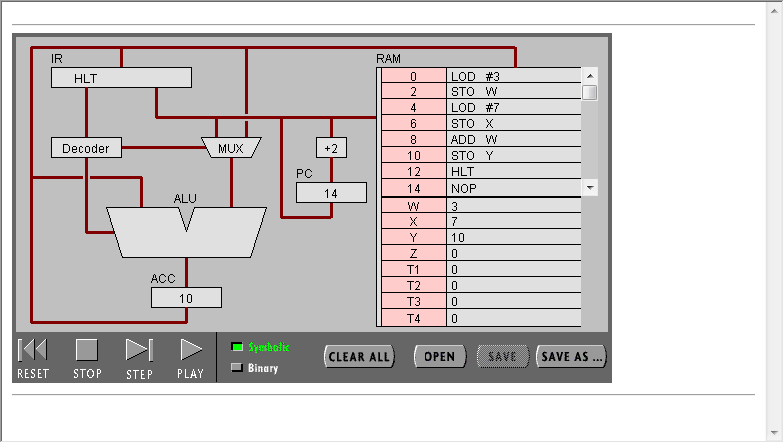
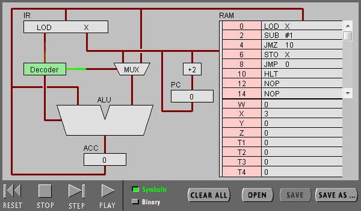
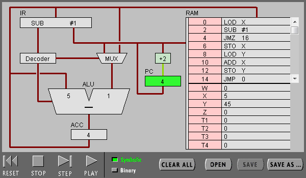
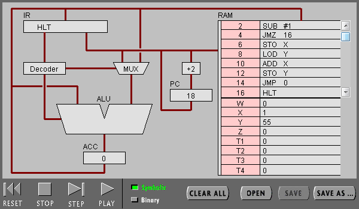

## 实验名称：硬件编程-机器指令编程
#### 学号：19335286
#### 姓名：郑有为

---

## **目录**
- [1.实验目标](#实验目标)
- [2. 实验步骤与结果](#实验步骤与结果)
    - [2.1. 任务一：简单程序](#任务一简单程序)
    - [2.2. 任务二：简单循环](#任务二简单循环)
- [3. 实验小结](#实验小结)

---

## 实验目标

1. 理解冯·诺伊曼计算机的结构
   
2. 理解机器指令的构成
   
3. 理解机器指令执行周期
   
4. 用汇编编写简单程序

---

## 实验步骤与结果

### 任务一：简单程序

#### （1）打开网页 [The PIPPIN User’s Guide](slides/The PIPPIN User’s Guide.html) ，然后输入 Program 1：Add 2 number

#### （2）点step after step。观察并回答下面问题：

##### PC，IR 寄存器的作用。

PC全称Program counter程序计数器，用于存放当前程序执行的下一行指令的地址，并会随着时钟信号更新。用于实现程序的顺序执行和条件跳转，循环跳转。
IR全称Instruction Register指针寄存器，存放指令内容，以便于译码器译码识别指令。

##### ACC 寄存器的全称与作用。

ACC（Accumulator）的全称是累加器。累加器是一个具有特殊用途的寄存器，专门用来存放操作数或运算结果。在CPU执行某种运算前，两个操作数中的一个通常应放在累加器中，运算完成后累加器中便可得到运算结果。

##### 用“LOD #3”指令的执行过程，解释Fetch-Execute周期。

Fetch：取指令过程，CPU根据PC中的地址从存储器RAM中找到对应的指令。
Execute：取出后放入IR，IR的内容经过译码器译码后，译码器发出控制信号使得累加器取等号（进行赋值运算），同时译码器发出控制信号将指令中存储的立即数输入到ALU中，计算结果保留在累加寄存器中，PC改指向当前指令的下一条，指令执行结束。

##### 用“ADD W” 指令的执行过程，解释Fetch-Execute周期。

Fetch：取指令过程，CPU根据PC中的地址从存储器RAM中找到对应的指令。
Execute：取出后放入IR，IR的内容经过译码器译码后，译码器发出控制信号使得累加器取加号（进行加运算），译码器将寄存器ACC中的数据取到ALU中，同时译码器发出控制信号将指令中存储的立即数取出，并通过这段立即数（W的地址）找到内存的相应位置取出数据，取出来的数据经过数据选择器进入ALU，在ALU中，该数据原本ACC的值相加，结果保存在累加寄存器中，PC改指向当前指令的下一条，指令执行结束。

##### “LOD #3” 与 “ADD W” 指令的执行在Fetch-Execute周期级别，有什么不同。

ADD W的指令周期更长，它访问了两次ALU，并且还需要寻址，从内存中取数据，而LOD #3只需要将指令中包含的二进制数写进累加器中，更快。

#### （3）点击“Binary”,观察回答下面问题

##### 写出指令 “LOD #7” 的二进制形式，按指令结构，解释每部分的含义。

LOD #7 :

00010100 00000111

前四位：000**1**表示该操作数是数值；
第五至第八位：0100 表示LOD指令的操作码；
后八位：00000111 存储7的二进制数。

##### 解释 RAM 的地址。

RAM指随机存取存储器。

通过网站The PIPPIN User’s Guide的介绍，实验中的RAM共有256Bytes，也就是说他的地址可以用八位二进制数表示，在实验CPU中，地址为00000000到01111111的内存空间用来存储程序执行指令，从地址为10000000到11111111的内存空间用来存储数据，例如W对应的地址是10000000。

需要注意的是，由于指令为16位，一条指令占两个字节，第一条指令的地址为00000000，而第二条指令的地址为00000010.

##### 该机器CPU是几位的？（按累加器的位数）

16位

##### 写出该程序对应的 C语言表达。

    w = 3;
    x = 7;
    y = x + w;

---

### 任务二：简单循环

#### （1） 输入程序Program 2，运行并回答问题：

##### 用一句话总结程序的功能
    
将存储在X的数字递减，直到X内的数字小于等于1

##### 写出对应的 c 语言程序

    do{
        x--;
    }
    while(x >= 1);

#### （2） 修改该程序，用机器语言实现 10+9+8+..1 ，输出结果存放于内存 Y

程序运行过程：

程序运行结果：

##### 写出 c 语言的计算过程

    int x = 11;
    int y;
    do{
        x--;
        y = y + x;
    }
    while(x > 0);

##### 写出机器语言的计算过程

    //我先将11存进了X中，否则则需要LOD 11 STO X两条指令来实现存入11.
    LOD X   //将X放入累加器
    SUB #1  //累加器内容-1
    JMZ 16  //分支判断，若累计器内容等于0则跳转到第8行指令
    STO X   //将累加器的内容存入X
    LOD Y   //将Y放入累加器
    ADD X   //取累加器中的数与X相加，结果存入累加器
    STO Y   //将累加器中的内容存入Y
    JMP 0   //跳转到第零条指令 LOD X处
    HLT     //结束程序

##### 用自己的语言，简单总结高级语言与机器语言的区别与联系。

区别：

1. 机器语言是计算机最原始的语言，是由0和1的代码构成，面向硬件，而高级语言采用接近于人类自然语言的单词和符号来表示一组低级语言程序，使编程变得更加简单，易学，且写出的程序可读性强。
2. 使用高级语言我们无需考虑数据是在寄存器中还是内存中，而机器语言需要考虑这些；
3. 高级语言的书写更加灵活，机器语言的指令语法更加严格，也更加精简；
4. 一条高级语言指令往往需要翻译成数条机器指令，意味着一般一条自然语言代码比一行汇编指令更加复杂。
5. 高级语言更偏向人的思考方式，机器语言则是“机器的思考方式”的体现。

联系：

1. 为了在计算机中执行高级语言程序，需先翻译成机器语言；
2. 一条高级语言指令往往能翻译成数条机器指令。

---

## 实验小结

通过本实验，我们了解了冯·诺伊曼计算机的基本体系结构和机器指令的构成，通过仿真工具Pippin CPUSim模拟了执行指令的动态过程，了解了其执行周期，并使用简单的语言编写了求和程序。

### 实验达成情况

实验目标达成。

---