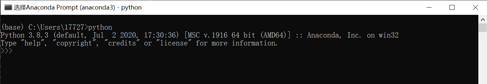
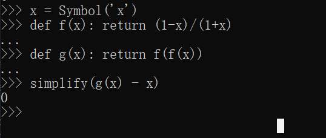
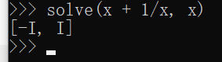
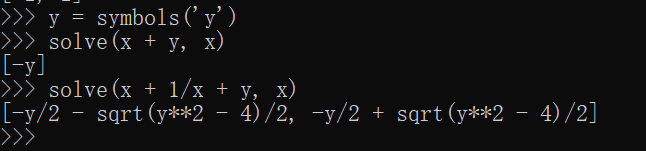
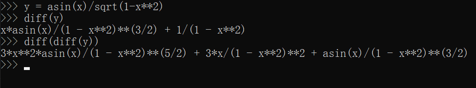
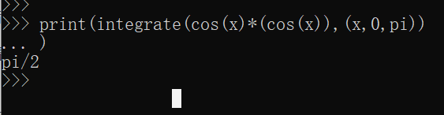
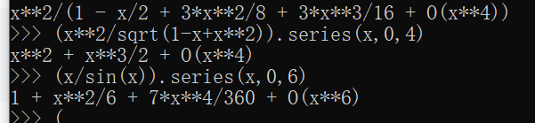
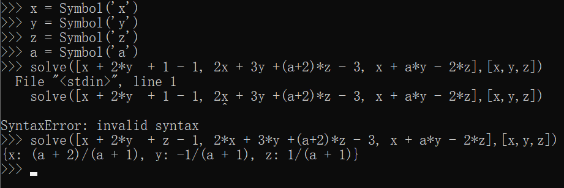
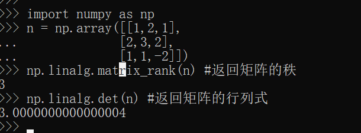
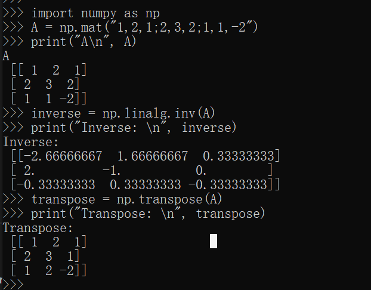

# Python 编程实验报告

# 实验目的

1. 用Python求解高数题
   1. 求解一元方程
   2. 求导
   3. 求积分
   4. 求泰勒展开

2. 用Python求解线代题
   1. 求解矩阵方程组
   2. 求行列式
   3. 求矩阵的逆
   
# 实验准备

下载并安装软件 Anaconda3

# 实验步骤和实验结果

## 用Python求解高数题
   
### 求解一元方程

1.**设 f(x) = (1 - x) / (1 + x), 求证 f(f(x)) = x.**(参考数分上册课本 Page24 第一题)

代码：

    x = Symbol('x')
    def f(x): return (1-x)/(1+x)
    def g(x): return f(f(x))
    simplify(g(x) - x)

运行结果与截屏：

2.**解 x + 1/x = 0**

运行结果与截屏：答案是两个虚数 i 和 -i

若再设置一个变量 y ,有

### 求导

**求 y = arcsin(x)/sqrt(1-x^2)的一阶导数和二阶导数。**(数分上册 Page 122.1.(3))

运行结果与截屏：

y' = x * arcsin(x)/(1 - x^2)^(3/2) + 1/(1 - x^2)

y'' = 3 * x^2 * arcsin(x) / (1 - x^2)\^(5/2) + 3*x/(1 - x^2)\^2 + aecsin(x)/(1 - x^2)\^(3/2)

### 求积分

求定积分 **\\int_{0}\^{\\pi}cos\^2(x)dx**(数分上册 Page 216.1.(1))

### 求泰勒展开

求在 x = 0 处泰勒展开(数分上册 Page 246.2.(3)(4))

x\^2 / sqrt(1 - x + x\^2) ,(x\^4);

x / sin(x) ,(x\^6);

## 用Python求解线代题

### 求解方程组
 
    x + 2y + z = 1
    2x + 3y + (a+2)z = 3
    x + ay - 2z = 0

### 求行列式
 
    1 2 1
    2 3 2
    1 1 -2

    import numpy as np
    n = np.array([[1,2,1], [2,3,2], [1,1,-2]])
    np.linalg.matrix_rank(n) #返回矩阵的秩
    np.linalg.det(n) #返回矩阵的行列式

### 求矩阵的逆和转置

    1 2 1
    2 3 2
    1 1 -2

    import numpy as np
    A = np.mat("1,2,1;2,3,2;1,1,-2")
    print("A\n", A)
    inverse = np.linalg.inv(A)
    print("Inverse: \n", inverse)
    transpose = np.transpose(A)
    print("Transpose: \n", transpose)

---

