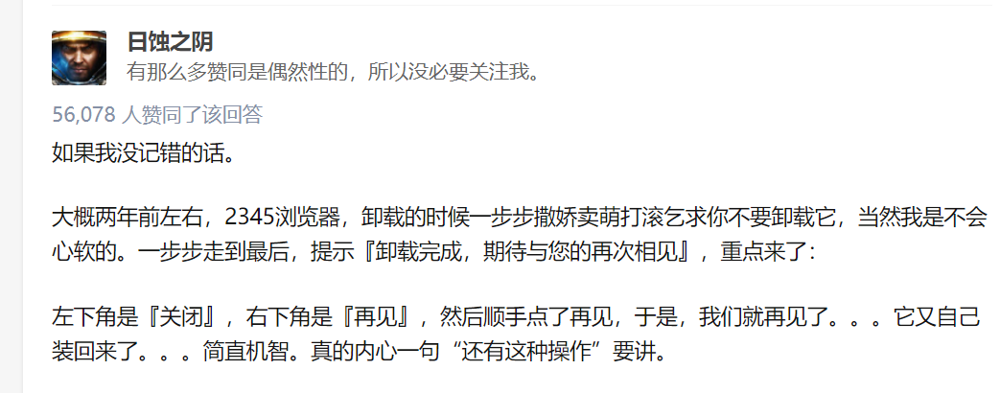
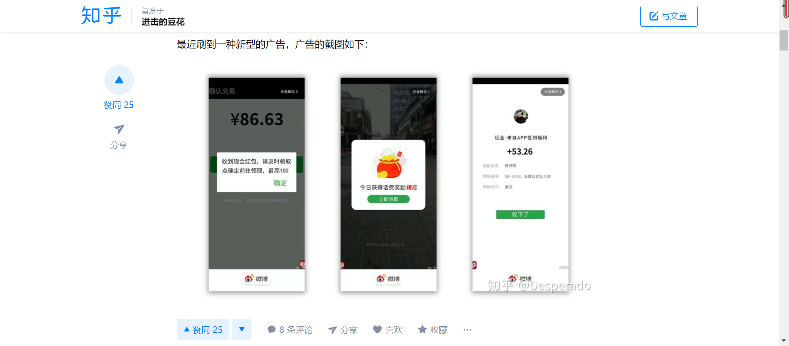

# IT伦理与道德讨论：流氓软件与垃圾广告

在互联网快速发展的今天，我们享受着互联网和软件给我们的服务与便利，而与此同时，提供软件的开发商为了利润向我们发送花样百出的广告，甚至利用用户对计算机不了解而修改用户内容，强制启动，强制弹出低质量的甚至具有欺骗性的广告。

一方面，我们免费使用软件，我们理应接受服务者提供广告，另一方面，服务商为了利润，不惜干涉我们对电脑的正常使用。流氓软件和垃圾广告充斥着整个软件市场，在法律尚未完善的情况下在试探伦理与道德的底线。

### 1. 流氓软件的概念
   
>“流氓软件”是介于病毒和正规软件之间的软件。如果电脑中有流氓软件，可能会出现以下几种情况：用户使用电脑上网时，会有窗口不断跳出；电脑浏览器被莫名修改增加了许多工作条；当用户打开网页时，网页会变成不相干的奇怪画面，甚至是黄色广告。^[百度百科：流氓软件]

流氓软件有着如下几个特点：

它采用多种社会和技术手段，**强行或者秘密安装，并抵制卸载**；**能强行修改用户软件设置**，如浏览器的主页，软件自动启动选项，安全选项；**强行弹出广告，或者其他干扰用户、占用系统资源行为**；有侵害用户信息和财产安全的潜在因素或者隐患；未经用户许可，或者利用用户疏忽，或者利用用户缺乏相关知识，秘**密收集用户个人信息、秘密和隐私**；**威胁恐吓或误导用户安装其他的产品**。 ^[百度百科：流氓软件]

### 2. 流氓软件的灰色产业链：
   
“流氓软件”的最大商业用途就是散布广告，并形成了整条灰色产业链：企业为增加注册用户、提高访问量或推销产品，向网络广告公司购买广告窗口流量，网络广告公司用自己控制的广告插件程序，在用户电脑中强行弹出广告窗口。
而为了让广告插件神不知鬼不觉地进入用户电脑，大多数时候广告公司是通过联系热门免费共享软件的作者，以每次几分钱的价格把广告程序通过插件的形式捆绑到免费共享软件中，用户在下载安装这些免费共享软件时广告程序也就趁虚而入。
据称，**网络广告的计费是按弹出次数**进行的，使用“流氓软件”可以在用户根本没有授权的情况下随意弹出广告，提高广告弹出次数，籍此提高广告收益。一个“装机量”大的广告插件公司，凭“流氓软件”月收入在百万元以上。^[百度百科：流氓软件]

### 3. 用户体验观感

案例1：2345浏览器

在知乎的一篇文章 https://zhuanlan.zhihu.com/p/150785825 中， 2345 浏览器，2345 好压被列入了强烈不建议安装的软件，起因是2345 浏览器会强制改变浏览器主页绑定，有着难删除，难彻底删除，频繁推送广告的特点。

在知乎讨论 **最流氓的软件可以流氓到什么程度？** 中有这么一篇回答：

让人哭笑不得的伴随安装

案例二：虚假的套路式广告

来自知乎用户风雨的回答：

### 4. 垃圾广告

参考知乎提问：**如何看待中国互联网垃圾广告问题？** https://www.zhihu.com/question/39396173

大多数人认为垃圾广告严重影响了上网的质量，低俗的，虚假的广告不仅会扭曲青少年儿童等群体，还可能使人受骗上当，净化互联网迫在眉睫。

而另一部分人认为：网站要生存，但这些流量小的网站不受那些大（正常）广告主的青睐，但他们要生存，要挣钱，所以只能有这些低级甚至虚假广告存在。而且在我们日常生活中处处存在着垃圾广告，电线杆，甚至是共享单车上都会有各种广告，单单对互联网，软件上的广告眼红是不公平的。

### 5. 误导性广告新花样

案例：拼多多
参考文章：令人讨厌的“拼多多” https://zhuanlan.zhihu.com/p/102700604

>没有选择把自己的logo放在显著位置而是将之“隐藏”起来已经说明拼多多“做贼心虚”。

>仔细分析一下这三个广告，其中一个是“签到福利”，意思是在app签到即可获得现金50～100元不等的转账，然而我翻遍了整个APP也没有看到一个“签到”功能。

>拿不存在的功能出来投放广告，这是实打实的欺骗了？

>再看另外两个广告，一个宣传的是充值送话费，另一个宣传的则是“天天领现金”的诱导分享活动，都是非常有技巧地将“最高10/100元，金额以实际为准”的字眼用接近背景色的深色隐藏起来，在两三秒的开屏广告时间内，很难被注意到。

>这种做法不可谓不“鸡贼”，也着实令人讨厌

个人使用软件体验：像拼多多，抖音，淘宝这样的广告经常出现在某些应用软件启动时，首先这些软件借助虚假的宣传含糊的说明引诱用户点进去，而一旦点击进去，不经过用户同意，后台就自动开始下载拼多多。如果多加注意还好，然而用户经常由于不小心触摸显示屏而“触发了这些扳机”，不小心下载软件。除此之外，广告会被做的非常有欺骗性：比如说广告投屏上会做一个虚假的“关闭”按钮，欺骗用户点进去下载软件，稍不注意或缺乏经验就会中招。

显然着不含欺骗性诱导性的因素，但由于执法难和定法难等因素使得这些“操作”猖狂地进行。

---

## 小结

总的来说，互联网环境还不够成熟，出现了花样百出令人不悦的流氓软件和垃圾广告；很大程度上，用户在去适应他们，就和适应如何对待骚扰电话一样，在我去浏览器上搜索“垃圾广告”，“流氓软件”时，出现非常多的话题是“如何彻底卸载软件”，“如何关闭广告投放”等等，在互联网发达的世界，用户们也自己去营造自己“舒适的冲浪之旅”，与流氓软件，垃圾广告抗衡。

有违背用户需要的软件不可能长期发展，那些曾经喧哗一时的流氓软件也慢慢被时代淘汰，一句话说得好：“时间在检验这一切”，在这个光速发展的互联网世界也是如此。

