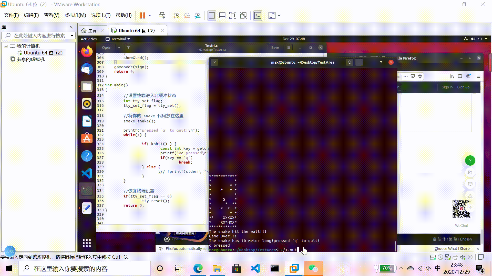

# 字符游戏 - 智能蛇

文档和程序地址：

https://gitee.com/WondrousWisdomcard/WondrousWisdomcard/tree/master/code/blog9

---

### 编写智能算法

编写人工智能程序，使得 snake 每秒自动走一步。

#### 1、程序要求说明

初始化字符矩阵中有一些你设定的障碍物（墙），并且保证非满地图中永远有且仅有一个食物。

决定蛇行走的方向的算法如下：

    char whereGoNext(int Hx, int Hy, int Fx, int Fy){
        char movable[4] = {'A','D','W','S'}; //记录可走的方向
        int distance[4] = {INF,INF,INF,INF}; //记录离食物的距离
        
        if(map[Hy][Hx-1] == BLANK_CELL || map[Hy][Hx-1] == SNAKE_FOOD){ //A
            distance[0] = abs(Fx - (Hx-1)) + abs(Fy - Hy);
        }
        if(map[Hy][Hx+1] == BLANK_CELL || map[Hy][Hx+1] == SNAKE_FOOD){ //D
            distance[1] = abs(Fx - (Hx+1)) + abs(Fy - Hy);
        }
        if(map[Hy-1][Hx] == BLANK_CELL || map[Hy-1][Hx] == SNAKE_FOOD){ //W
            distance[2] = abs(Fx - Hx) + abs(Fy - (Hy-1));
        }
        if(map[Hy+1][Hx] == BLANK_CELL || map[Hy+1][Hx] == SNAKE_FOOD){ //S
            distance[3] = abs(Fx - Hx) + abs(Fy - (Hy+1));
        }

        int i, min = INF,j = INF; // j为最后决策方向的编号
        for(int i = 0; i < 4; i++){
            //printf("%d\n",distance[i]);
            if(distance[i] < min){
                min = distance[i];
                j = i;
            }
        }
        if(j != INF){
            printf("%c",movable[j]);
            return movable[j];
        }
        return 'A'; //如果蛇蛇的所有方向都不可走，随机己返回一个方向结束游戏
    }

##### 思考：一个长度为5的障碍物能困死该自动跑的蛇吗？

会，比如：

        **
    $   *  HXXXX
        **

由于蛇蛇的方向决策时只考虑下一个方向对应的位置是否能走，无法避开像上图这样的情况，蛇蛇会一直向左走，而不会绕过这个"陷阱"，最后导致游戏结束。

#### 2、智能蛇的程序框架
	
    initMap(); //地图初始化
    putOneFood(); //随机创建一个食物
    for(int i = 0; i < 10; i++){ //随机创建十个障碍
        putOneBlock();
    }

    sleep(1); 
    printf("\033[2J"); //每隔一秒刷新命令行显示
    showGird(); //初始表格显示

    int sign = 0;
    char direction = 'N';
    while(sign == 0){
        direction = whereGoNext(snakeX[snakeLength-1], snakeY[snakeLength-1], foodX[topFoodIndex], foodY[topFoodIndex]); //智能决策
        switch(direction){ //执行蛇的移动
            case 'A': sign = snakeMove(-1,0); break;
            case 'D': sign = snakeMove(1,0); break;
            case 'W': sign = snakeMove(0,-1); break;
            case 'S': sign = snakeMove(0,1); break;
            default : printf("...\n"); break;
        }
        if(topFoodIndex == -1){ //我们规定只有蛇蛇把地图上仅有的食物吃掉后再生成新的食物
            putOneFood();
        }
        if(sign == 0){
            showGird(); //移动后显示表格
        }  
    }
    gameover(sign); //结束游戏

##### 成果展示

最终程序能在Linux下运行，借助VT100终端标准自动刷新终端动态显示网格的功能。

可以看到小蛇自己动了起来，最后由于算法和障碍的设置而游戏失败：

#### 评价

通过这个实验，我们体验了最简单的智能算法用在蛇蛇的走动上，实现了蛇蛇自己寻找食物；让蛇有一定的智能，能通过算法具有 “感知 - 决策 - 行动” 的能力。

在借助Linux命令行的IO设计的控制上，更完整地实现了一个基于命令行的小游戏。

