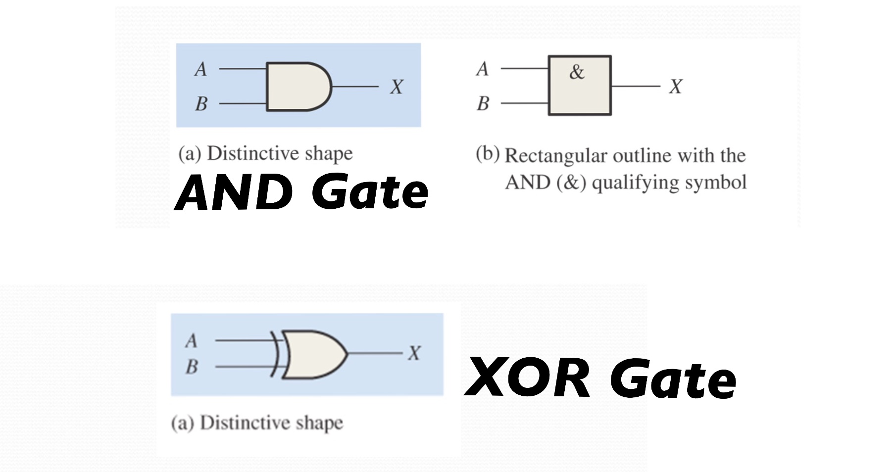
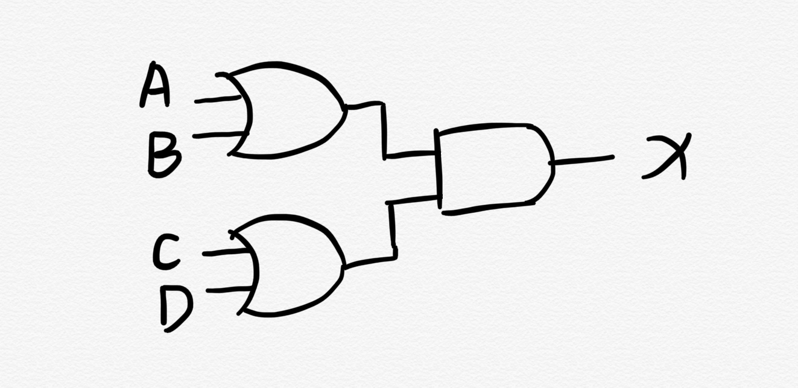
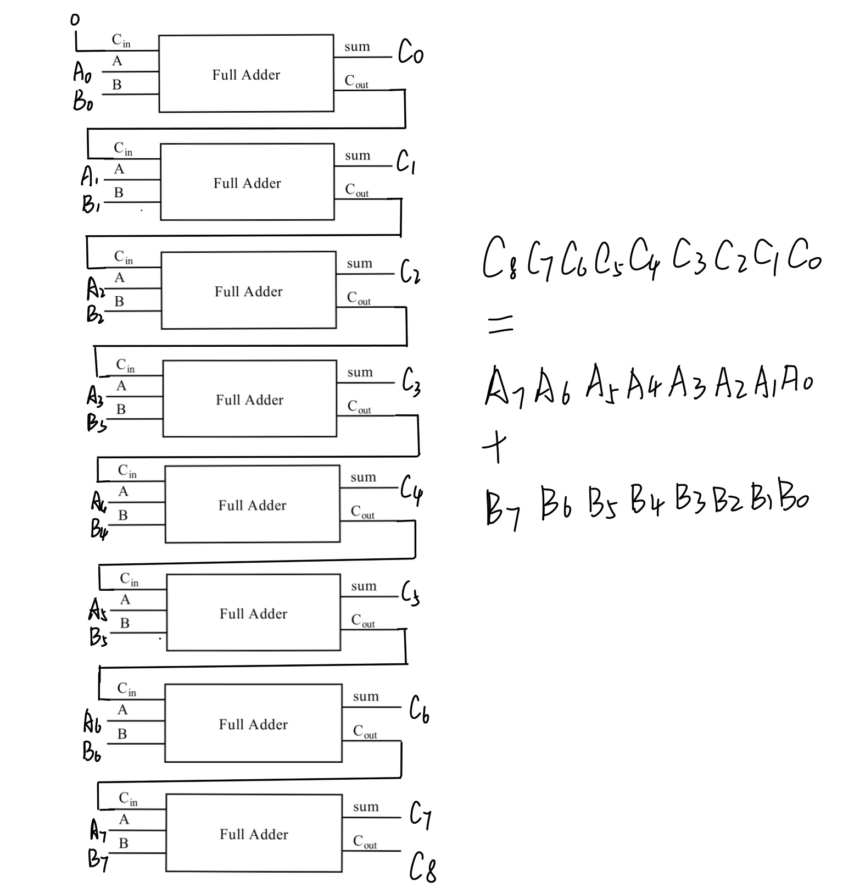

---

### 1) AND Gate 与门

**解释**

与门有n个输入,1个输出,当且仅当所有输入为1时输出为1,否则输出为0.

**Representation** 

设 A,B 为输入, X 为输出
1. Truth Table 

    |  A   |  B   |  X   |
    | :--: | :--: | :--: |
    |  0   |  0   |  0   |
    |  0   |  1   |  0   |
    |  1   |  0   |  0   |
    |  1   |  1   |  1   |

2. Boolean Expression
    
    X = A + B

3. Logic Diagram Symbol (Image Below)

### 2) XOR Gate 异或门

**解释**

与门有2个输入,1个输出,当且仅当所有输入相同时输出为0,否则输出为1.

**Representation** 

设 A,B 为输入, X 为输出
1. Truth Table 

    |  A   |  B   |  X   |
    | :--: | :--: | :--: |
    |  0   |  0   |  0   |
    |  0   |  1   |  1   |
    |  1   |  0   |  1   |
    |  1   |  1   |  0   |

2. Boolean Expression

    令A'表示A的非,B'表示B的非

    X = A ⊕ B = A B' + A' B

3. Logic Diagram Symbol (Image Below)

### 3) Draw a circuit diagram about X=(A+B)(C+D)

### 4)  Show the behavior of the following circuit with a truth table

设输出为X,令A'表示A的非，有 X = (A') ⊕ (AB),真值表如下:

|  A   |  B   |  X   |
| :--: | :--: | :--: |
|  0   |  0   |  1   |
|  0   |  1   |  1   |
|  1   |  0   |  0   |
|  1   |  1   |  1   |

### 5) What is circuit equivalence? Use truth table to prove the following formula. 

(AB)' = A' + B' 等价

    |A|B| AB | (AB)' | A' | B' | A'+B' | (AB)'=A'+B' |
    |:--:| :--: | :--: | :--: |  :--: | :--: | :--: | :--: |
    |0|0|0| 1 | 1 | 1 | 1 | 1 |
    |0|1|0| 1 | 1 | 0 | 1 | 1 |
    |1|0|0| 1 | 0 | 1 | 1 | 1 |
    |1|1|1| 0 | 0 | 0 | 0 | 1 |
    
从真值表可以看出(AB)'=A'+B'为永真式,所以(AB)'和A'+B'等价。

### 6)  Combine 8 Full Adders to 8bit adder circuit

### 7) Fill the follow expression 

令X'表示X的非:

(1) (X8X7X6X5X4X3X2X1)2 or (00001111)2 = ((X8X7X6X51111)2

(2) (X8X7X6X5X4X3X2X1)2 xor (00001111)2 = (X8X7X6X5X4'X3'X2'X1')2

(3) ((X8X7X6X5X4X3X2X1)2 and (11110000)2)
or (not (X8X7X6X5X4X3X2X1)2 and (00001111)2) = (X8X7X6X5X4'X3'X2'X1')2

---

## 关键词解释 from Wikipedia

### Logic Gate

In electronics, a logic gate is an idealized or physical device implementing a Boolean function; that is, it performs a logical operation on one or more binary inputs and produces a single binary output. 

### Boolean Algebra

In mathematics and mathematical logic, Boolean algebra is the branch of algebra in which the values of the variables are the truth values true and false, usually denoted 1 and 0 respectively. the main operations of Boolean algebra are the conjunction and denoted as ∧, the disjunction or denoted as ∨, and the negation not denoted as ¬.

### Flip-Flops

(1). 中文翻译：(双稳态)触发器

(2). Q: How many bits information does a SR latch store? A: **1 Bit**.

--- 