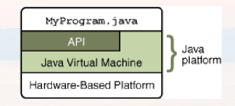
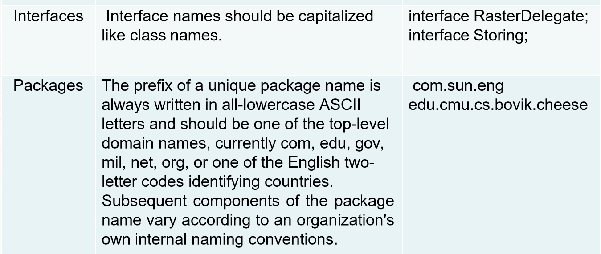
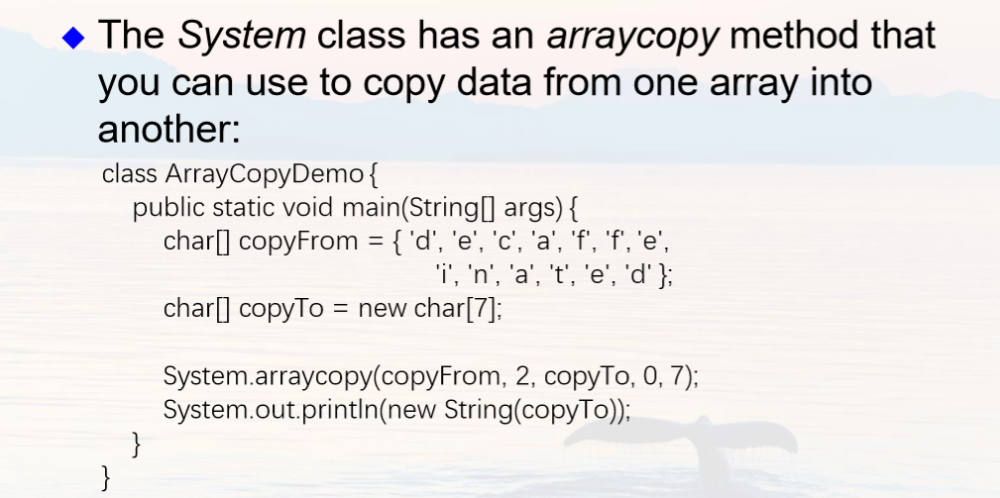
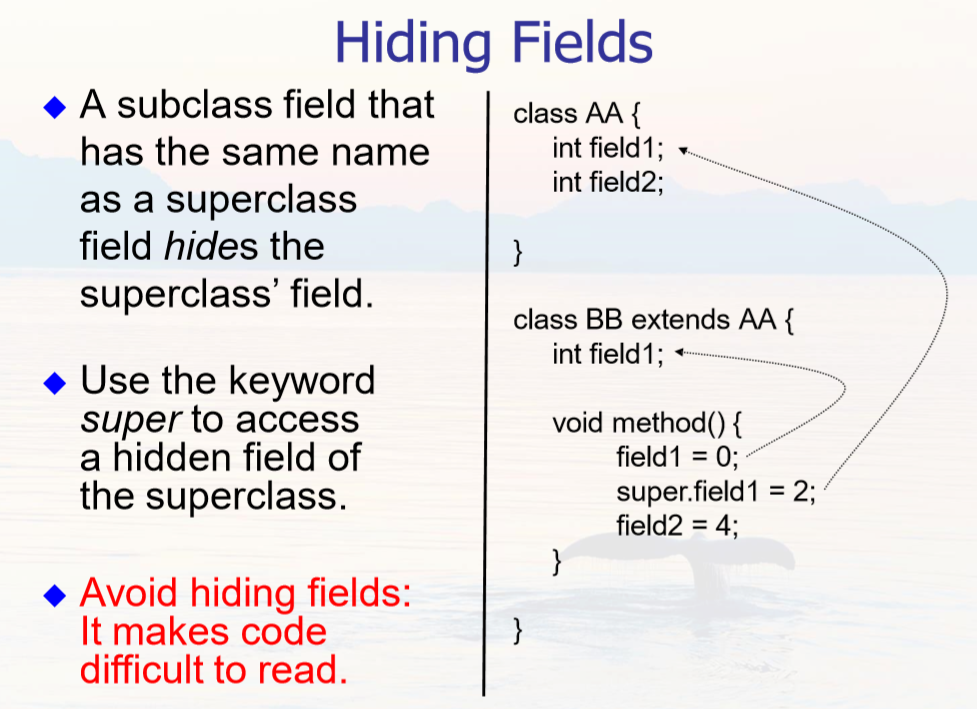

# Chapter 1 & 2 Introduction to Objects

---

## Background

Java technology includes **Java programming languages** and **Java platform**

文件扩展名 .java 被编译器javac编译成 .class 文件-Java虚拟机的机器语言，再通过Java启动器工具使用JavaVM的实例运行应用程序

Java Platform has two components: The Java Virtual Machine(**JavaVM**) and The Java Application Programming Interface
(**API**)

The API(https://docs.oracle.com/javase/6/docs/index.html) is a large collection of ready-made  software components. The API provides many useful capabilities:  

It is grouped into libraries of related classes and  interfaces; 
These libraries are known as packages .

 The Java Runtime Environment (**JRE**) provides the libraries, the Java Virtual Machine, and other components to run applets and applications written in the Java programming language. The Java Development Kit (**JDK**) is a superset of the JRE, and contains everything that is in the JRE, plus tools such as the compilers and debuggers necessary for developing applets and applications.

---

## Run file welcome.java

    public class Welcome{  //class name: welcome
        public static void main(String[] args){ //main method 
            System.out.println("Welcome toJava!"); 
            } 
        }

Save the text to the file: **Welcome.java** 
 
Compile the program typing: **javac Welcome.java** 
 
Run the program typing: **java Welcome**
 
Output of theprogram: Welcome to Java!

Every Java program must have at least one class. Each class has a name,并且文件名需与类名相同。

---

## 类和对象

An object stores its state in fields (variables in some programming languages).
An object exposes its behavior through  methods (functions in some programming  languages).（与C++大同小异）

---

# Chapter 3 Language Basics

非常多跟C都是一样的，下面是我选的一些有差异的语法

##### 1.The 8 primitive (or native) data types are: byte, char,  short, int, long, float, double, and **boolean**

##### 2. char字符类型的定义是 16-bit Unicode UTF-16 character

##### 3. 使用未初始化的局部变量会导致编译时错误

##### 4. String class (defined in *java.lang*)

    String s1 = new String(“this is a String”);
    String s2 = “this is another String”;
    String s2 = null; // no String object assigned 

##### 5. Array (注意声明数组的语法和length)

    int[] a1 = new int[5];  
    int[] a2 = { 1,2,3,4,5 };
    String[][] names = {{"Mr. ", "Mrs. "}, {"Smith", "Jones"}}; 
    int aL = a1.length;
    a2.length = 6; //error

##### 6. **null** It represents an invalid object or one that has not been created yet.

##### 7. **instanceof**是Java中的一个双目运算符，用来测试一个对象是否为一个类的实例
    boolean result = obj instanceof Class
    //其中 obj 为一个对象，Class 表示一个类或者一个接口，当 obj 为 Class 的对象，或者是其直接或间接子类，或者是其接口的实现类，结果result 都返回 true，否则返回false，并且 obj 必须为引用类型，不能是基本类型

##### 8. 数组的拷贝(方法 System.arrayCopy)

---

# Chapter 4 IO Basics
    import java.util.Scanner;
    public class Test {
        public static void main(String args[]){        
            Scanner s = new Scanner(System.in); 
            String name = s.nextLine(); 
            int ival = s.nextInt(); 
            System.out.println(ival + "," + name); 
        } 
    }

---

# Chapter 5 Inheritance

---
##### 1. keyword **extends** 

    public class Bicycle {};
    public class MountainBike extends Bicycle {};

##### 2. Every class has one and only one direct superclass (single inheritance). Only **java.lang.Object** has no superclass. Every class is implicitly a subclass of **Object**.

##### 3. The constructor of the superclass can be invoked from the subclass by using the keyword **super**.

    public MountainBike(int startHeight, int startCadence, int startSpeed, int startGear){ 
        super(startCadence, startSpeed, startGear);//调用父类的构造函数 
        seatHeight = startHeight; 
    } 

##### 4. 声明一个对象

    MountainBike myBike = new MountainBike(); 

##### 5. casting 类型转换

    Object obj = new MountainBike(); //ok 隐式类型准换
    MountainBike myBike = obj; // error 
    if(obj instanceof MountainBike) { 
        MountainBike myBike = (MountainBike)obj; // 显式类型转换 
    }

##### 6.  You can write a new **instance** method in the subclass that has the same signature as the one in the superclass, thus **overriding** it.  You can write a new **static** method in the subclass that has the same signature as the one in the superclass, thus **hiding** it. 

    public classAnimal { 
        public static void testClassMethod() { 
            System.out.println("The class method inAnimal."); 
            } 
            public void testInstanceMethod() { 
                System.out.println("The instance method inAnimal."); 
            } 
        } // end of theAnimal 
    class public class Cat extends Animal { 
        public static void testClassMethod() { 
            System.out.println("The class method in Cat."); 
            } 
        public void testInstanceMethod() { 
            System.out.println("The instance method in Cat."); 
            } 
        public static void main(String[] args) { 
            Cat myCat = new Cat(); 
            Animal myAnimal = myCat; 
            Animal.testClassMethod(); 
            myAnimal.testInstanceMethod(); 
            } 
        } // end of the Cat class

output: 

    The class method in Animal. //因为是static
    The instance method in Cat. //因为是动态绑定

The Cat class overrides the instance method in Animal and hides the class method in Animal.

The version of the hidden method that gets invoked is the one in the superclass, and the version of the overridden method that gets invoked is the one in the subclass.

If your method overrides one of its superclass's methods, you can invoke the overridden method through the use of the keyword **super**

A subclass has no access to a **private** field or method of its superclass

##### 7. **super** and Constructors

Invocation of a superclass constructor must be the first line in the subclass constructor

If a constructor does not explicitly invoke a superclass constructor, the Java compiler automatically inserts a call to the no-argument constructor of the superclass

If the super class does not have a no-argument constructor, you will get a compile-time error

    public class Animal{
        public Animal(int i){} //删除这一行后下面就不会报错
    };
    public class Dog extends Animal{
        public Dog(){
            super();//报错
        }
    }

##### 8. The **final** Keyword

A final method cannot be overridden by a subclass, for example: final void method() { … }

An entire class can be declared final to prevent the class from being subclassed:  public final class String { … }

---
