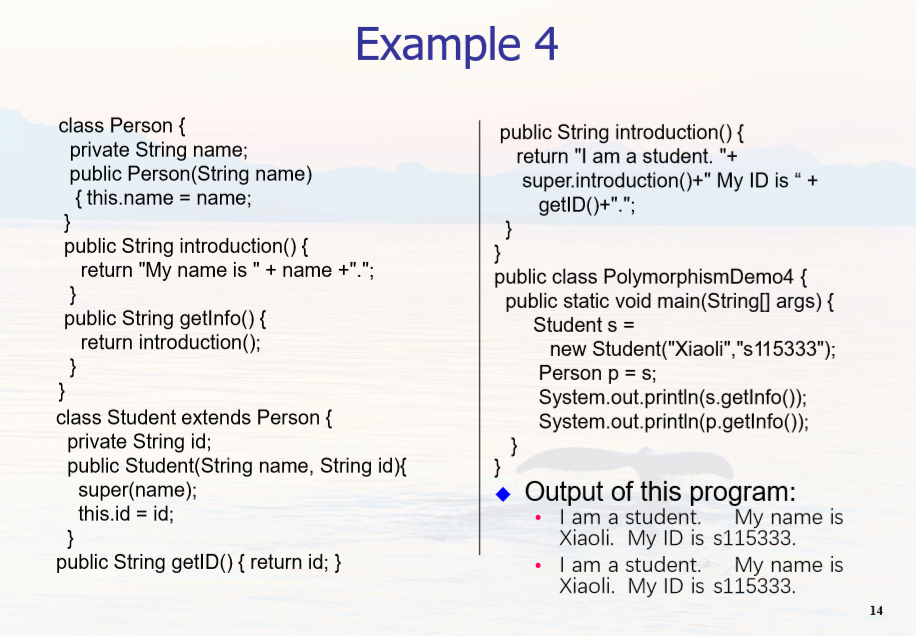
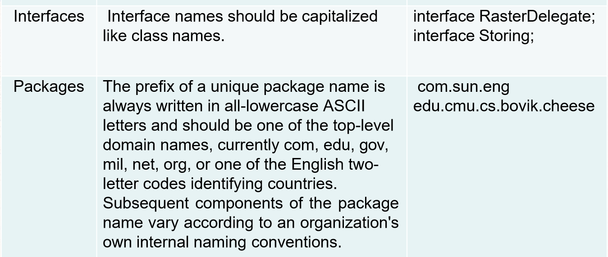

# Chapter 6 Polymorphism 多态

In programming, polymorphism is the ability for same code to be used with several different types of objects and behave differently depending on the actual type of object used.

Alternate views of polymorphism: 

One objects sends a message to another object without caring about the type of the receiving object.

The receiving object responds to a message appropriately for its type. 
 
**Java methods are polymorphic by default**

static or final ( private methods are implicitly final ) are bound at compile time.

对于多态，可以总结以下几点： 

一、使用父类类型的引用指向子类的对象；（以下都是动态绑定）

    //(1) Student extends Person
    Student s = new Student("Xiaoli","s115333"); 
    Person p = s; 
    //(2) 函数传参
    public static void main(String[] args) { 
        m(new Student("Xiaoli", "s115333")); 
        m(new Person( “Xiaowang")); 
    } 
    public static void m(Person x) { 
        System.out.println(x.introduction()); 
    }
    //(3) 数组
    Person[] people = { 
        new Person(" Xiaoli "), 
        new Student(“Xiaowang", “s116000"), 
        new Person(" Xiaozhang")
    }; 

//(4) 理解一下
    
    

**二、该引用只能调用父类中定义的方法和变量；**

**三、如果子类中重写了父类中的一个方法，那么在调用这个方法的时候，将会调用子类中的这个方法；（动态连接、动态调用）;** 

四、变量不能被重写（覆盖），”重写“的概念只针对方法，如果在子类中”重写“了父类中的变量，那么在编译时会报错。 

###### 来自 https://blog.csdn.net/kaiwii/article/details/8042488

**C++ 中普通成员函数加上 virtual 关键字就成为虚函数。
Java 中其实没有虚函数的概念，它的普通函数就相当于 C++ 的虚函数，动态绑定是 Java 的默认行为。如果 Java 中不希望某个函数具有虚函数特性，可以加上 final 关键字变成非虚函数**。 

###### 来自 https://www.runoob.com/note/40084

##### 动态绑定的过程

 We can conceptually think of the dynamic binding mechanism as follows: Suppose an object o is an instance of classes C1, C2, ..., Cn-1, and Cn, where C1 is a subclass of C2, C2 is a subclass of C3, ..., and Cn-1 is a subclass of Cn.  
 
 That is, Cn is the most general class, and C1 is the most specific class. In Java, Cn is the Object class. 
 
 If o invokes a method p, the JVM searches the implementation for the method p in C1, C2, ..., Cn-1 and Cn, in this order, until it is found. Once an implementation is found, the search stops and the first-found implementation is invoked.

##### 抽象类 Abstract Class

**An abstract class** is a class that is declared abstract—it may or may not include abstract methods. Abstract classes cannot be instantiated, but they can be subclassed.

**An abstract method** is a method that is declared without an implementation. If a class includes abstract methods, the class itself must be declared abstract.

    public abstract class GraphicObject { 
        // declare fields 
        // declare non-abstract methods 
        abstract void draw(); 
    }

When an abstract class is subclassed, the subclass usually provides implementations for all of the abstract methods in its parent class. However, **if it does not, the subclass must also be declared abstract**.

##### Static Method

If a method is static, it does not behave polymorphically.  Static methods are associated with the class and not the individual objects.

---

# Package 包 (自学)

来自 https://www.runoob.com/java/java-package.html

Java 使用包（package）这种机制是为了防止命名冲突，访问控制，提供搜索和定位类（class）、接口、枚举（enumerations）和注释（annotation）等。

    package pkg1[．pkg2[．pkg3…]]; //语法格式
    //Something.java
    package net.java.util; 
    public class Something{
    ...
    } //那么它的路径应该是 net/java/util/Something.java 这样保存的。 package(包) 的作用是把不同的 java 程序分类保存，更方便的被其他 java 程序调用。

java.lang-打包基础的类

java.io-包含输入输出功能的函数

##### 创建一个包

    /* 文件名: Animal.java */
    package animals;
    
    interface Animal {
    public void eat();
    public void travel();
    } //在 animals 包中加入一个接口（interface）

接下来，在同一个包中加入该接口的实现：
MammalInt.java 文件代码：

    package animals;
    /* 文件名 : MammalInt.java */
    public class MammalInt implements Animal{
        public void eat(){
            System.out.println("Mammal eats");
        }
        public void travel(){
            System.out.println("Mammal travels");
        } 
        public int noOfLegs(){
            return 0;
        }
        public static void main(String args[]){
            MammalInt m = new MammalInt();
            m.eat();
            m.travel();
        }
    }

##### import 关键字

为了能够使用某一个包的成员，我们需要在 Java 程序中明确导入该包。使用 "import" 语句可完成此功能。 
在 java 源文件中 import 语句应位于 package 语句之后，所有类的定义之前，可以没有，也可以有多条，其语法格式为：

    import package1\[.package2…\].(classname|*);

一个类想要使用本包中的另一个类，那么该包名可以省略。 

---

C/C++ 的 #include会把所包含的内容在编译时添加到程序文件中，而java的import则不同。
Java 对象名称分为包（package）名和类（class）名两部分
package名称就像是我们的姓，而class名称就像是我们的名字 。
比如说java.lang.String，就指明了String类是属于java.lang这个包的。
可是现在问题来了，有的包名非常的长，使用某些类的时候就要写一大串的代码，看起来非常不简洁也降低开发效率，于是Sun公司就引入了import。
在Java文件开头的地方使用import 导入某些类，java文件开头的地方，先说明会用到那些类别。 
接着我们就能在代码中只用类名指定某个类，无需写包名。

来源 https://www.zhihu.com/question/324436383/answer/684131107

---