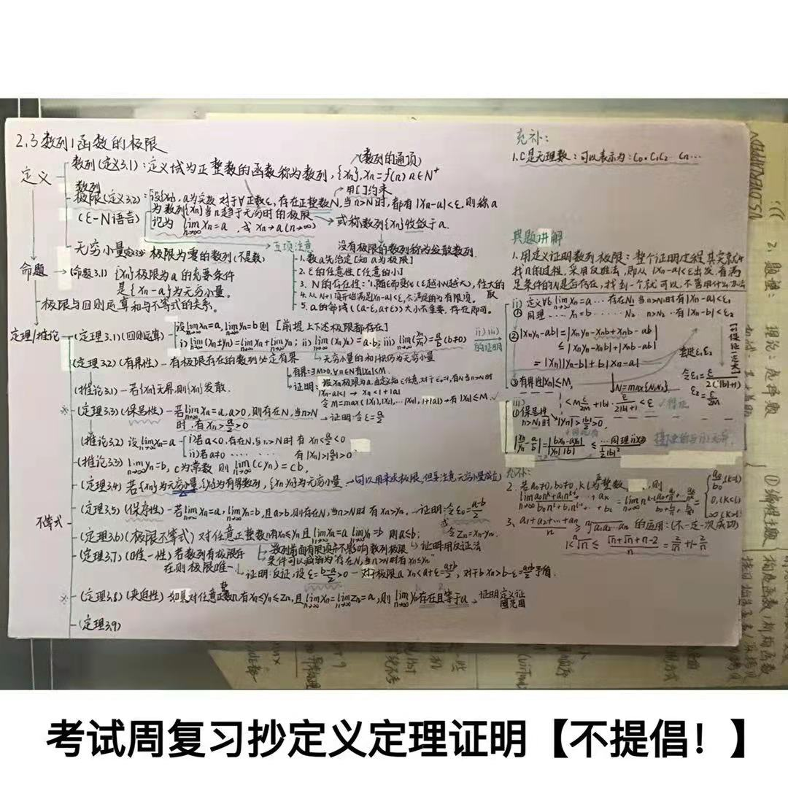
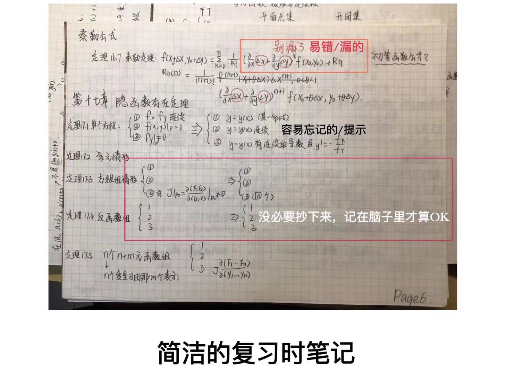
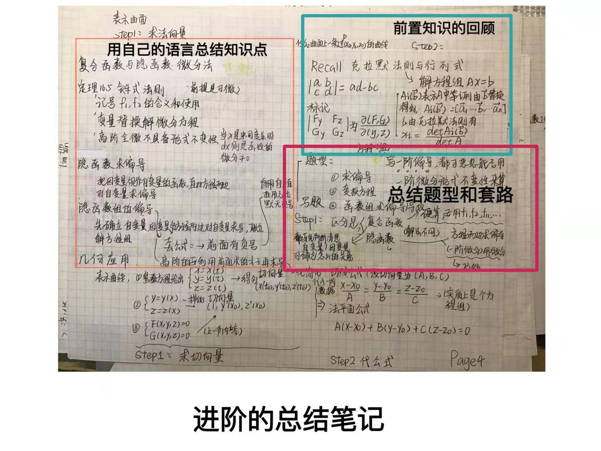
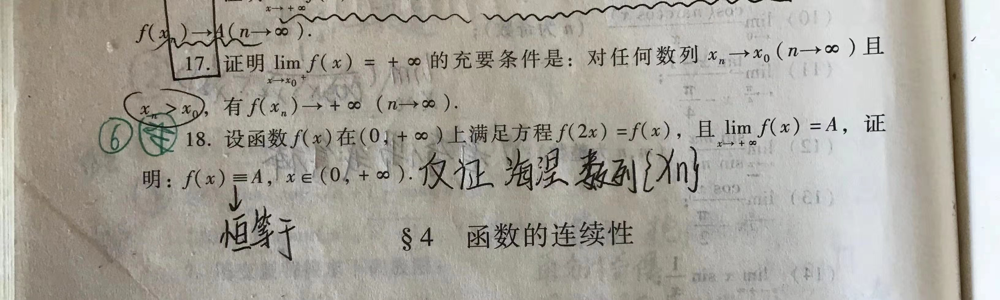

# 第二次课业辅导 - 个人复习经验
#### 19软工 郑有为

*个人摸索的收获，仅供参考，希望能给你一点启发*

---

### 1、工程化的复习方式：

#### **系统化**
准备：如果你还没有… 整理老师课件/整理自己的作业

1. 什么时候开始复习？我还有课/论文/大作业？不用焦虑，优先把任务做完留时间复习

2. 推荐考试周前一周开始陆陆续续利用零散的时间复习，考试周是留给考试和考试复习的，不是用来赶DDL的

3. 提前制定时间表和任务清单：考试时间，**考试间隙**的复习安排？

#### **规范化**

1. 图书馆（考试周图书馆爆满，看你能不能早起了） > 自习室/教室（人相对不会那么多） > 宿舍（看情况）

2. 消遣软件？报复性反弹，不如卸载

3. 屏幕管理APP比如Forest

    

#### **可度量**

1. 复习笔记反应复习效果

2. **心理激励：成果汇报**

---

### 2、数学类
*笔者没有学高数，可能复习思路有些不同*

1. 优质的考前笔记：知识点照搬(x) 错题摘抄(x) 总结型笔记(ok)

    **总结型笔记**：必要的整合归纳，关键词，容易忘的/容易忽略的 这一节会考什么题 部分题的解法和思路（技巧收集贴） 易错点/易疏忽点

    *存着！别扔！以后有用* 
    
    XMind/纸质版都OK

    

    

    

2. **证明题**
   
    对于课后习题，如果不懂，看答案写大体思路（以关键词形式呈现）

    

    **不交白卷**，没有思路则优先把自己能想到的东西写上去（比如写定理）

---

### 3、编程类

1. 机试考前复习：
（每周都有编程训练的话，一般没啥好复习的）

    1. 如果你想刷题的话：**刷其他教学班的题**（找其他班的朋友要）会比洛谷，Leetcode好一些
    
    2. 考试周最多是实现一下之前没怎么弄清楚的算法（比如排序，括号匹配等等）

2. 机试考试：
    1. 本地测试：（Linux）最起码的gcc test.c -o test 和 ./test要懂，用适合自己的IDE

    2. 有时候，打表也是思路

    3. 写不出来/没时间了：（迫不得已）骗编译分

3. 理论复习：考前刷 **考试酷**
   
    问一下老师提不提供理论题库，如果谁有可以一起分享

---

### 4、英语

1. **考原文的!**

    看一遍课本阅读 -> 阅读题和翻译

    听一遍课本听力 -> 听力题

2. **引词跟踪法** （需要坚持训练）
   
    1. 不依赖听力原文材料，连续听听力的同时跟读

    2. 每听一句英语，停住听力，原文复述
   
    https://m.weibo.cn/status/4528033685572212

---

### 5、军理/史纲

1. **二维码**题库刷题 - 考试题库/模拟考试

    

2. 课本课后主观题/答案： 网上找(成套的)/课本找

    **主观题基本就是课后习题里的主观题**

---

**祝大家期末顺利考试成功！**

2020-12-06